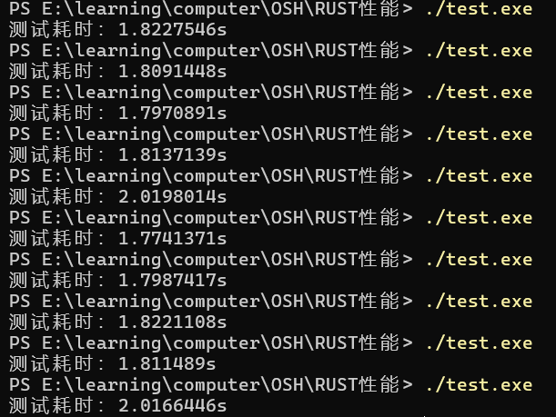
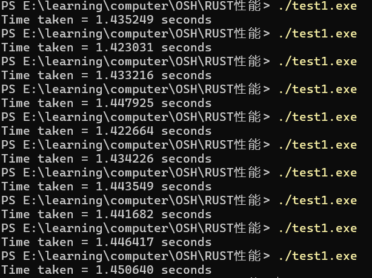
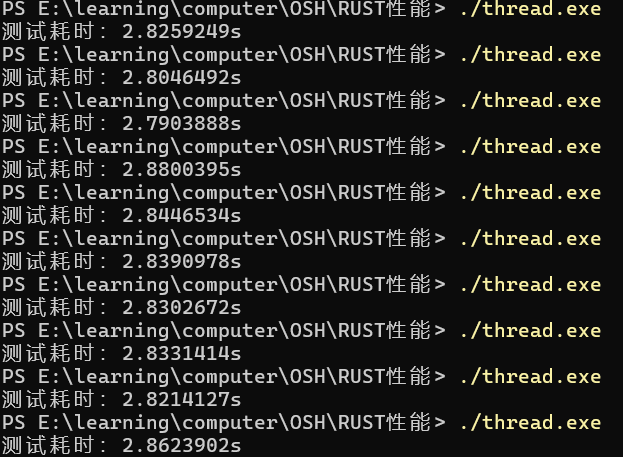
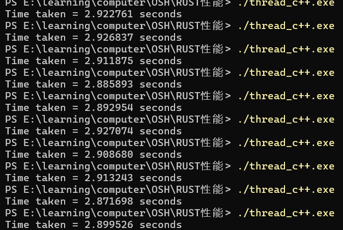

# 使用Rust重新编写C++项目
## 目录

- [使用Rust重新编写C++项目](#使用rust重新编写c项目)
  - [目录](#目录)
  - [1. 引言](#1-引言)
    - [背景介绍](#背景介绍)
    - [改写目的](#改写目的)
  - [2. 理论依据](#2-理论依据)
    - [1. 并发安全性的基础：所有权与借用机制](#1-并发安全性的基础所有权与借用机制)
    - [2. 内存安全与并发控制](#2-内存安全与并发控制)
    - [3. 高级并发抽象与零成本抽象](#3-高级并发抽象与零成本抽象)
    - [4. 通过 API 安全放宽所有权规则](#4-通过-api-安全放宽所有权规则)
  - [3. 技术对比分析](#3-技术对比分析)
  - [RUST与C++串并行性能测试](#rust与c串并行性能测试)
    - [RUST串行程序](#rust串行程序)
    - [C++串行程序](#c串行程序)
    - [小结](#小结)
    - [RUST并行程序](#rust并行程序)
    - [C++并行程序](#c并行程序)
    - [小结](#小结-1)
  - [4. 前沿成果与案例研究](#4-前沿成果与案例研究)
    - [游戏开发中的并发性能](#游戏开发中的并发性能)
    - [Servo浏览器引擎](#servo浏览器引擎)
  - [5. 结论](#5-结论)
  - [6. 参考文献](#6-参考文献)

## 1. 引言

### 背景介绍
Linux内核，作为世界上最广泛使用的操作系统内核之一，其性能和安全性对全球数百万计算设备至关重要。传统上，Linux内核及其模块主要使用C语言编写，部分高性能用户空间应用则采用C++。然而，随着软件复杂性的增加以及对系统安全与可靠性需求的提升，现有编程语言的内存安全问题和并发处理挑战日益凸显。Rust语言，以其现代的语言特性和对安全的重视，被提议为现有系统组件的替代语言，尤其是在高并发和高安全需求的场景中。

### 改写目的
本报告旨在探讨将Rust语言引入Linux内核开发的可行性，特别是替换或重写现有的C++模块。重写的主要目的包括：

- 提高内存安全：Rust的所有权和借用机制自然防止了数据竞争和空指针等常见的安全问题。
- 增强并发处理能力：Rust的线程安全保证无锁编程的可能性，可在不牺牲性能的前提下提升并发执行效率。
- 性能对比：通过对比Rust和C++在处理相同任务时的性能表现，评估Rust的实际运行效率和资源利用情况。
## 2. 理论依据

### 1. 并发安全性的基础：所有权与借用机制
Rust语言通过其独特的所有权和借用机制在编译阶段消除数据竞争，显著提高了程序的安全性和效率。在Rust中，每个变量都有一个明确的所有者，并且在任何时刻内，要么只允许存在一个可变引用，要么允许存在多个不可变引用。这样的设计有效预防了状态不一致和竞争条件的发生，从根本上在编译时而非运行时解决了并发中的安全问题，如数据竞争和迭代器失效等。

进一步地，Ardito等人在2020年的研究中开发出了一种名为“rust-code-analysis”的工具，这一工具利用抽象语法树（AST）分析技术从源代码中分析和提取可维护性信息。该工具不仅可以检测潜在的编译前错误，还能量化代码复杂性，进而验证Rust的安全机制如何在实际应用中减少编程错误和提升代码质量。这些研究成果进一步证实了Rust语言在保障软件安全性方面的实际效果和潜力，尤其在需要高度并发处理的系统开发领域中展现出其优势。[1]（Ardito et al., 2020）

### 2. 内存安全与并发控制
Rust 的内存管理模型通过自动内存管理和精确的生命周期控制来避免常见的内存错误，如使用后释放（use-after-free）和空指针访问。Rust 通过确保内存安全性，使得并发程序更加稳定可靠。与传统的系统编程语言如 C 或 C++ 相比，Rust 不仅减少了安全漏洞的风险，还提供了更细粒度的控制来优化程序性能。[2]（Jung et al., 2020）

### 3. 高级并发抽象与零成本抽象
Rust 利用类型系统和生命周期的概念，提供了高级并发抽象，如 async/await，允许开发者编写高效的异步代码而不牺牲性能。这种零成本抽象的策略意味着在保持高性能的同时，提升了代码的表达力和安全性。 Rust 的这一特性对于开发复杂的系统级应用程序尤其重要，因为它们通常需要同时处理高性能和高安全性。[2]（Jung et al., 2020）

### 4. 通过 API 安全放宽所有权规则
虽然 Rust 的核心所有权和借用模型对于大多数系统编程任务而言已足够，但某些特定的数据结构和设计模式可能需要更灵活的内存和状态管理策略。Rust 允许通过安全的 API 放宽这些规则，使得开发者可以在保证整体程序安全性的前提下，使用更灵活的内存管理策略。这些 API，如 Mutex 和 Arc，提供了在多线程环境中安全共享可变状态的能力，强调了 Rust 在实现安全并发编程中的先进性。[2]（Jung et al., 2020）

## 3. 技术对比分析

## RUST与C++串并行性能测试
为了验证RUST与C++分别在串行与并行运行程序时的性能，在正式开始项目之前，我们首先对相同的简单程序在两种语言下的运行时间做了比较。以下结果均是在无任何优化编译条件下产生的。

### RUST串行程序

```RUST
// 导入必要的库
use std::time::Instant;
 
fn main() {
    // 设置迭代次数
    const ITERATIONS: u16 = 10;
 
    // 初始化计时器
    let timer = Instant::now();
 
    // 执行性能测试的代码块
    for _ in 0..ITERATIONS {
        // 放入需要测试性能的代码
         let _ = expensive_function();
    }
 
    // 计算耗时并打印结果
    let elapsed = timer.elapsed();
    println!("测试耗时：{:?}", elapsed);
}
 
// 这是一个代价较高的函数，用于演示性能测试
fn expensive_function() -> u64 {
    let mut result = 0;
    for i in 1..100_000_000 {
        result += i;
    }
    result
}
```
这段RUST代码中的 expensive_function() 完成了从1加到1亿并返回结果的功能，并且这个函数被调用了10次。以下是运行时间：


计算平均值得到，这个程序运行时间约为1.849s
### C++串行程序

```c++
#include <time.h>
#include <stdio.h>
#include <sys/time.h>
long long expensive_function(){
	long long res=0;
	for(int i=1;i<100000000;i++){
		res+=i;
	}
	return res;
}
int main() {
	struct timeval t1, t2;
	gettimeofday(&t1, NULL);
	// 调用大开销函数
	for(int i = 0; i < 10; i++){
		expensive_function();
	}
	gettimeofday(&t2, NULL);
	
	double time = (t2.tv_sec - t1.tv_sec) + (t2.tv_usec - t1.tv_usec) * 1e-6;
	printf("Time taken = %f seconds\n", time);
	
	return 0;
}
```
同样，这段C++代码中的 expensive_function() 依然是完成了与刚才RUST中函数一样的效果，并且这个函数也被调用了10次，因此两种语言所写的程序完成的任务是一致的。以下是该程序的运行时间：


计算平均值得到，这个程序运行时间约为1.438s
### 小结
通过对比可以看到，在处理**简单**的串行程序方面，RUST的性能还与C++有一定差距，接下来我们来看简单的并行程序在两种语言下的表现。
### RUST并行程序
```RUST
use std::thread;
use std::sync::{Arc, Mutex};
use std::time::Instant;
 // 导入必要的库
fn expensive_function() {
    let counter = Arc::new(Mutex::new(0));
    let mut handles = vec![];
 
    for _ in 0..10 {
        let counter = Arc::clone(&counter);
        let handle = thread::spawn(move || {
            let mut num = counter.lock().unwrap();
            for j in 0..10{
                *num += j;
            }
        });
        handles.push(handle);
    }
 
    for handle in handles {
        handle.join().unwrap();
    }
}
 
fn main() {
    // 设置迭代次数
    const ITERATIONS: u64 = 10000;
 
    // 初始化计时器
    let timer = Instant::now();
 
    // 执行性能测试的代码块
    for _ in 0..ITERATIONS {
         let _ = expensive_function();
    }
 
    // 计算耗时并打印结果
    let elapsed = timer.elapsed();
    println!("测试耗时：{:?}", elapsed);
}
```
这段代码中的 expensive_function() 实现了十个线程对互斥资源 num 分别累加10次的操作，在main函数中这个函数被调用了10000次，以下是运行时间：


计算平均值得到，这个程序运行时间约为2.833s
### C++并行程序
```c++
#include <iostream>
#include <thread>
#include <atomic>
#include <time.h>
#include <stdio.h>
#include <sys/time.h>

std::atomic<int> counter(0); // 定义一个原子计数器

void increment() {
	for (int i = 0; i < 10; ++i) {
		counter+=i;
	}
}


int expensive_function() {
	std::thread t1(increment);
	std::thread t2(increment); 
	std::thread t3(increment);
	std::thread t4(increment);
	std::thread t5(increment);
	std::thread t6(increment);
	std::thread t7(increment);
	std::thread t8(increment);
	std::thread t9(increment);
	std::thread t10(increment);
	
	t1.join(); // 等待线程1完成
	t2.join(); // 等待线程2完成
	t3.join();
	t4.join();
	t5.join();
	t6.join();
	t7.join();
	t8.join();
	t9.join();
	t10.join();
	
	return 0;
}
int main() {
	struct timeval t1, t2;
	gettimeofday(&t1, NULL);
	// 执行你的代码
	for(int i = 0; i < 10000; i++){
		expensive_function();
	}
	gettimeofday(&t2, NULL);
	
	double time = (t2.tv_sec - t1.tv_sec) + (t2.tv_usec - t1.tv_usec) * 1e-6;
	printf("Time taken = %f seconds\n", time);
	
	return 0;
}
```
这段代码与上面RUST语言写的并行代码相同，函数是十个线程对同一个互斥资源进行累加操作，并且这个函数被调用了10000次，以下是运行时间：


 计算平均值得到，这个程序运行时间约为2.906s
 ### 小结
 可以看到，RUST在并行程序上的性能表现好于C++，说明尽管RUST在串行程序性能上没有C++优势明显，但是RUST优秀的并发特性弥补了这一点不足，使得RUST在并发性能上甚至反超了C++。

## 4. 前沿成果与案例研究

### 游戏开发中的并发性能
- **案例背景**
  在游戏开发领域，性能优化尤为关键，因为它直接影响到游戏的流畅度和用户体验。并发编程在此领域中尤为重要，因为现代游戏常常需要处理大量数据和复杂的用户交互。
- **应用分析**
1. **匿名函数的使用**
   在游戏开发中，匿名函数常用于编写事件驱动的逻辑和自定义行为，如 AI 决策树和回调函数。根据研究，Rust 在创建匿名函数方面表现更佳，这意味着在构建复杂的游戏逻辑和模块化设计时，Rust 可能提供更高的开发效率和更好的性能优化空间。然而，C++ 在调用匿名函数方面的优势表明，对于需要频繁执行这些函数的高性能游戏引擎部分，如渲染回调和实时计算，C++ 可能是更合适的选择。
2. **哈希表的操作**
   游戏开发中经常使用哈希表来管理游戏对象和状态，例如，玩家的物品清单或游戏世界中的实体映射。研究表明，Rust 在搜索和删除哈希表中的条目时效率更高，这对于游戏中的动态环境管理和实时资源清理非常有利。相反，C++ 在哈希表的插入操作中表现更优，适合于游戏初始化和资源加载阶段，快速构建游戏的数据结构。
3. **多线程的管理**
   现代游戏开发越来越依赖于多线程技术来提高性能，特别是在图形渲染、物理计算和AI处理等方面。Rust 在线程合并方面的优势表明，它能更有效地管理线程的生命周期和资源回收，这对于保持游戏性能和避免资源泄漏至关重要。而 C++ 在创建和启动线程方面的优势则有助于游戏快速响应玩家的交互和游戏事件。
- **小结**
  Rust 的内存管理和线程安全特性使其成为需要高度稳定性和效率的游戏项目的理想选择。而 C++ 的灵活性和在某些性能关键操作中的优势，则使其在需要极致性能的游戏引擎开发中仍然占有一席之地。[3](Nordström et al.,2023)
### Servo浏览器引擎
- **案例背景**
在现代网络浏览器的开发中，性能和安全性是至关重要的。这些浏览器不仅需要快速渲染网页，还必须在面对日益复杂的网络安全威胁时保持稳定和安全。Servo是由Mozilla研究团队开发的一个实验性浏览器引擎，旨在探索并实现下一代浏览器技术。Servo特别利用了Rust语言的特性，如内存安全和并发性，来优化性能和提高安全性。

- **应用分析**

1. **并行渲染技术**
Servo浏览器引擎采用Rust的并发能力，实现了并行渲染技术。这允许浏览器在处理复杂的网页布局和脚本时，能够在多个处理器核心上同时进行工作，显著提高了页面加载速度和渲染效率。通过利用Rust的所有权和借用模型，Servo确保了渲染过程中的数据安全，避免了传统浏览器开发中常见的数据竞争和内存泄漏问题。

2. **组件化架构**
Servo采用了高度模块化的架构设计，每个组件都独立运行在自己的Rust任务中，这进一步增强了系统的安全性和可维护性。这种架构使得每个组件都可以独立更新和优化，而不会影响到整个系统的稳定性，同时也便于开发者快速定位和修复问题。

3. **安全增强**
Rust的内存安全特性极大地降低了Servo在解析恶意输入时出现安全漏洞的风险。传统的C++浏览器引擎常常需要实施额外的安全措施来防范内存错误，而Servo则通过Rust的内置安全机制，自然地避免了这些问题。

- **小结**
Servo项目是Rust在高性能、高安全性浏览器引擎开发中的一次重要尝试。通过充分利用Rust的并发和内存安全特性，Servo不仅提高了网页的渲染速度，还提升了整个浏览器的稳定性和安全性。这些成果展示了Rust在现代软件开发中的巨大潜力，尤其是在需要处理高并发和高安全要求的领域中。(https://servo.org/)

## 5. 结论
通过对比Rust和C++在内存安全、并发处理能力和性能表现等方面的特性和优势，我们得出以下结论:
1. **内存安全**
   Rust的所有权、借用和生命周期管理机制在编译时防止了数据竞争和空指针解引用等问题，大大增强了内存安全。这是Rust相较于C++的显著优势，尤其在安全关键的系统编程领域。

2. **并发处理**
   Rust的线程安全保证和无锁编程特性使其在并发执行效率上优于C++。这一点对于需要高并发处理的Linux内核模块开发尤为重要，能有效提高系统的稳定性和响应速度。

3. **性能对比**
   尽管Rust在某些性能测试中表现不如C++，特别是在串行计算任务中，但在多线程和需要高并发的应用场景下，Rust显示出了更好的性能表现。这表明Rust的并发优势可能在复杂的系统级应用中更为突出。
## 6. 参考文献
[1] Ardito, L., Barbato, L., Castelluccio, M., Coppola, R., Denizet, C., Ledru, S., & Valsesia, M. (2020). rust-code-analysis: A Rust library to analyze and extract maintainability information from source codes. SoftwareX, 12, 100635. https://www.sciencedirect.com/science/article/pii/S2352711020303484

[2] Ralf Jung, Jacques-Henri Jourdan, Robbert Krebbers, and Derek Dreyer. 2021. Safe systems programming in Rust. Commun. ACM 64, 4 (April 2021), 144–152. https://doi.org/10.1145/3418295

[3] Nordström, O., & Raivio, L. (2023). Performance evaluation of Multithreading, Hashtables, and Anonymous Functions for Rust and C++ : in Game Development (Dissertation). Retrieved from https://urn.kb.se/resolve?urn=urn:nbn:se:bth-25559
