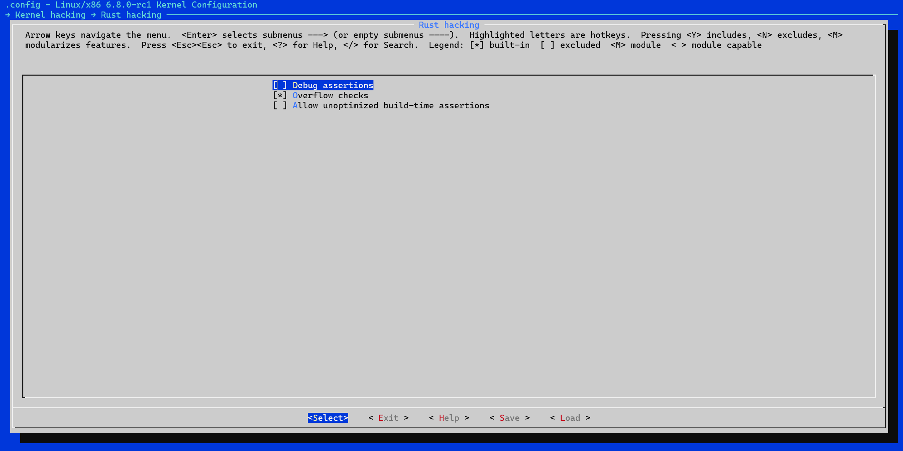

# 关于用Rust改写Linux操作系统的可行性报告
####  mkdir队(组长:潘铂凯 组员:胡揚嘉 金培晟 刘宇恒 王翔辉)
<!-- vscode-markdown-toc -->
## 目录
* 1. [摘要](#摘要)

* 2. [理论依据](#理论依据)
    * 2.1. [初步理论分析](#初步理论分析)
    * 2.2. [模块选择分析](#模块选择分析)
        * 2.2.1. [简介](#)
        * 2.2.2. [正文](#)
            - [内核模块分析筛选（kernal）](#内核模块分析筛选kernal)
                - [Rust语言在Linux内核中的应用优势简介](#rust语言在linux内核中的应用优势简介)
              - [模块选择分析](#模块选择分析)
                - [1.blktrace（2000+）](#1blktrace2000)
                  - [使用Rust改写blktrace的考虑](#使用rust改写blktrace的考虑)
                  - [结论](#结论)
                - [2.bpf-trace（3500+）](#2bpf-trace3500)
                  - [使用Rust改写bpf-trace的考虑](#使用rust改写bpf-trace的考虑)
                  - [结论](#结论-1)
                - [3.fork.c（3500+）](#3forkc3500)
                  - [使用Rust改写forc.c的考虑](#使用rust改写forcc的考虑)
                  - [结论](#结论-2)
                - [4.core.c（12000+）](#4corec12000)
                  - [使用Rust改写core.c的考虑](#使用rust改写corec的考虑)
                  - [结论](#结论-3)
            - [内存数据管理模块分析筛选（mm）](#内存数据管理模块分析筛选mm)
              - [Rust语言在Linux内存数据管理模块中的应用优势简介](#rust语言在linux内存数据管理模块中的应用优势简介)
              - [模块选择分析](#模块选择分析-1)
                - [vmalloc.c（4000+）](#vmallocc4000)
                  - [使用Rust改写vmalloc.c的考虑](#使用rust改写vmallocc的考虑)
                  - [结论](#结论-4)
            - [其余模块分析筛选](#其余模块分析筛选)
              - [1. 小型设备驱动模块](#1-小型设备驱动模块)
              - [2. 网络协议辅助模块](#2-网络协议辅助模块)
              - [3. 文件系统的特定辅助工具模块](#3-文件系统的特定辅助工具模块)
              - [4. lib中的list\_sort.c模块](#4-lib中的list_sortc模块)
        * 2.2.3. [结论](#结论)

* 3. [技术依据](#技术依据)
    * 3.1. [Rust与C对接技术](#rust与c对接技术)
    * 3.2. [模块集成技术](#模块集成技术)
        *  samples/rust/ 下的样例源代码
        *  Kernel hacking 下的 Rust hacking 菜单
    * 3.3. [性能测试技术](#性能测试技术)
* 4. [创新点](#创新点)
* 5. [参考文献](#参考文献)
* 6. [相关链接](#相关链接)

<!-- /vscode-markdown-toc -->

## 摘要

本文主要讨论了用Rust语言重写Linux操作系统的可行性。首先，我们选择了一些Linux操作系统的内核模块进行了分析。最后，我们讨论了Rust语言与C语言的对接技术、模块集成技术和性能测试技术，认为Rust语言可以与C语言进行对接，可以通过模块集成技术将Rust语言的模块集成到Linux操作系统中，可以通过性能测试技术对Rust语言的性能进行测试。综上所述，我们认为用Rust语言重写Linux操作系统是可行的。

##  理论依据

### 2.1. 初步理论分析
Rust 是一种系统编程语言，它的设计目标是提供内存安全和并发性，同时保持高性能。Rust 的这些特性使得它成为改写 Linux 操作系统的一个理想选择。

首先，Rust 的内存安全保证可以减少操作系统中的一类常见错误。通过在编译时检查内存访问，Rust 可以防止空指针解引用、双重释放等问题，这些问题在 C 和 C++ 中是常见的。这种内存安全保证可以使得操作系统更加稳定，减少因内存错误导致的系统崩溃。

其次，Rust 的并发性支持可以帮助操作系统更好地利用多核处理器。Rust 的所有权和生命周期系统可以在编译时检查数据竞争，这使得并发编程更加安全。此外，Rust 的异步编程模型可以帮助操作系统更高效地处理 I/O 操作，提高系统的响应速度。

最后，Rust 的性能与 C 和 C++ 相当，这使得它可以用于系统编程。Rust 的零成本抽象使得开发者可以在不牺牲性能的情况下使用高级语言特性，如模式匹配、类型推断等。

### 2.2. 模块选择分析

#### 2.2.1. 简介

>我们希望能够在运用Rust改写Linux模块的过程中充分的发挥Rust语言相较于C语言的种种优势，如安全性、并发性等优秀特性，因此我们在选择相关模块进行改写的过程中需要充分考虑到这些特性，扬长避短，如我们倾向于改写对安全性要求较高，但是目前安全性仍未得到充分保障的模块/大量使用并发性数据传输与处理，需要提升模块的稳定性和响应性的模块，而不是对安全性要求不高/偏向于线性处理数据的模块。因此，充分的模块调研是必要的，并且这阶段模块分析筛选的过程并不影响我们技术性和理论性可行性分析，故我们对其进行了并行的分析处理，以期得到最佳的选择。

## 2.2.2. 正文
>我们希望优先从Linux内核模块以及内存数据管理模块进行分析筛选，因为这部分模块大多对安全性要求很高，并且常常伴随着大量的并行数据的处理，十分适配于Rust语言的改写，当然，对如此重要的模块进行改写也会伴随着巨大的挑战，我们将结合待选模块的优势以及将会面临的挑战进行分析，筛选出目前较为合适的模块以备改写。

### 内核模块分析筛选（kernal）
#### Rust语言在Linux内核中的应用优势简介

>##### 内存安全
>Rust通过所有权、借用和生命周期概念，在编译时防止了空指针解引用、缓冲区溢出等常见的内存安全问题，这对于内核模块是至关重要的。由于内核中的错误可能会导致整个系统的崩溃，使用Rust可以大大降低这类风险。
>
>##### 并发安全
>Linux内核高度依赖并发，而Rust的并发模型提供了数据竞争的安全保护，使得并发编程更加安全和容易。Rust的安全并发特性有潜力改善内核模块的稳定性和响应性。
>
>##### 性能考量
>Rust在某些情况下可能引入额外开销，但它的高级抽象和性能优化特性也为性能的提升提供了可能。Rust编译器的高效代码生成能力有望在保持安全性的前提下，为Linux内核带来性能上的提升。

#### 模块选择分析

##### 1.blktrace（2000+）

>`blktrace`是一个Linux工具，用于追踪块层（block layer）的I/O（输入/输出）操作。块设备，如硬盘驱动器、固态硬盘和其他形式的存储设备，在Linux中是通过块层来管理的。`blktrace`能够捕获和记录发生在指定块设备上的I/O事件，提供了一种手段来分析和理解存储设备的性能问题和行为模式。

具体而言，`blktrace`可以帮助做到：
- **性能分析**：测量和分析块设备的I/O性能，包括读写操作的延迟、队列深度等。
- **问题诊断**：帮助诊断I/O瓶颈、性能抖动或异常I/O模式等问题。
- **系统优化**：通过详细的I/O追踪数据，为系统配置和存储硬件选择提供依据。

###### 使用Rust改写blktrace的考虑

1. 优点

- **内存安全**：Rust提供的内存安全保证可以减少在处理复杂数据结构时可能出现的错误，特别是在并发环境下。
- **并发处理**：Rust的并发模型能够帮助开发者更安全、更容易地构建多线程应用，这对于`blktrace`这样需要高效处理大量数据的工具来说是一个明显的优势。
- **现代语言特性**：Rust的现代语言特性（比如模式匹配、所有权模型等）可能提供更清晰和更可维护的代码结构。

2. 挑战

- **性能考量**：尽管Rust设计为能够提供与C相当的性能，但在特定的跟踪和监控场景下，细微的性能差异可能导致显著的影响。因此，保持性能至关重要，需要仔细地设计和优化。
- **系统层面的集成**：`blktrace`需要深入到Linux内核的块层来捕获事件，使用Rust可能需要解决调用内核API和处理内核数据结构的兼容性和互操作性问题。
- **生态系统和工具支持**：虽然Rust的生态系统正在快速发展，但相对于C语言，针对系统编程和性能监控工具的支持可能还不够成熟。

###### 结论

>使用Rust重写`blktrace`从理论上讲是有益的，尤其是在提高代码质量、安全性和可能的并发性能方面。然而，由于`blktrace`的工作方式紧密依赖于Linux内核，这项工作不仅需要深入理解Linux块设备的工作原理，还需要克服Rust在系统级编程方面的一些限制和挑战。因此将对`blktrace`的改写列入进一步待选模块。

##### 2.bpf-trace（3500+）

>Linux中的`bpf-trace`是一种基于BPF (Berkeley Packet Filter，伯克利包过滤器) 的高级追踪语言，用于创建内核追踪和观察。它利用了Linux中的eBPF（扩展BPF）技术，允许用户在内核中运行经过限制的小程序（BPF程序），而无需更改内核源代码或加载外部模块。

具体而言，`bpf-trace`可以帮助做到：
- **性能监控与分析**：`bpf-trace`可以监控和记录系统和应用程序的运行时行为，帮助分析性能问题。
- **动态追踪**：它支持动态地追踪内核函数、用户级函数、系统调用等，是理解和分析系统行为的强大工具。
- **自定义追踪**：用户可以编写简单的脚本来定义他们想要追踪的事件和相应的动作，使得追踪更加灵活和定制化。
- **安全分析**：通过追踪系统调用和内核函数的执行，`bpf-trace`可以用于检测潜在的安全漏洞和异常行为。

###### 使用Rust改写bpf-trace的考虑

1. 优点

- **内存安全**：Rust的内存安全保障可以减少在处理复杂追踪逻辑时可能出现的安全问题，尤其是在操作系统层面。
- **并发安全**：Rust的并发编程模型可以提高`bpf-trace`在处理并行追踪任务时的安全性和效率。
- **现代语言特性**：Rust提供的现代编程语言特性（比如类型推导、模式匹配等）可以简化`bpf-trace`的开发和维护。

2. 挑战

- **eBPF集成**：`bpf-trace`的核心功能依赖于eBPF技术，Rust改写需要充分考虑与内核eBPF子系统的集成方式，这可能需要解决Rust与C语言互操作的相关问题。
- **生态系统和工具链**：虽然Rust的生态系统快速发展，但在eBPF领域，相较于C语言，可能仍缺乏一些工具和库支持。
- **性能考量**：尽管Rust被设计为能够提供与C相当的性能，但在特定的内核追踪场景下，性能仍需经过实际测试来验证，确保改写后的`bpf-trace`不会引入不必要的开销。

###### 结论

>总体而言，使用Rust改写`bpf-trace`在理论上是有益的，特别是从提高代码的安全性和可维护性方面。然而，这样的项目需要仔细规划和执行，确保与Linux内核的兼容性，并且充分利用Rust语言的优势，同时避免潜在的性能陷阱。因此将对`bpf-trace`的改写列入进一步待选模块。

##### 3.fork.c（3500+）

>Linux内核中的`fork.c`模块是负责进程创建(fork系统调用)的核心模块。它的主要功能是复制当前进程的上下文(包括内存映射、文件描述符、信号处理程序等),创建一个新的进程。这是操作系统最基本也是最核心的功能之一。

###### 使用Rust改写forc.c的考虑

1. 优点

- **代码简洁性**:`fork.c`模块的代码行数较多,包含了大量的边界检查、错误处理等底层细节。使用Rust重写,可以利用其安全性特性(所有权、借用等)消除大量重复代码,从而使代码更加简洁、易读。
- **内存安全**：C语言中的手动内存管理容易导致内存错误,如悬空指针、内存泄漏等。Rust的所有权系统能在编译期就捕获这些错误,从根本上避免内存相关的安全漏洞,对于如此核心的模块来说,这是非常宝贵的。
- **线程安全**：`fork.c`中需要处理父子进程之间的同步,如复制内存映射、信号处理程序等。C语言中常用的锁机制容易导致死锁、优先级反转等并发问题。Rust的线程安全原语能更好地控制并发,提高模块的稳定性。

2. 挑战

- **内核接口适配**：`fork.c`模块与内核的其他模块(如内存管理、文件系统等)有着密切的交互,重写后需要保证与现有内核接口的兼容性,这可能需要编写适配层代码。
- **并发复杂性**：进程创建涉及到大量的并发操作,如父子进程之间的同步、信号处理等,移植到Rust语言可能需要格外小心处理这些并发逻辑。
- **内核编程实践（经调研认为是很大的困难）**：Rust语言在内核编程领域的实践相对较少,可能会遇到一些特殊的问题或限制,需要进一步的探索和解决。
- **性能考量**：虽然理论上Rust程序的性能不会比C程序差,但具体到进程创建这种底层操作,需要进行细致的基准测试,评估实际的性能影响。

###### 结论

>总的来说,使用Rust重写`fork.c`模块能够显著提高代码的安全性和可维护性,同时也有望获得一定的性能提升。但由于这是一个核心且复杂的模块,在实际操作中需要格外注意内核环境的特殊性,妥善处理接口适配、并发复杂性等问题。因此将对`fork.c`的改写列入进一步待选模块。

##### 4.core.c（12000+）

>core.c模块是进程调度器的核心部分,负责管理进程的调度和上下文切换。它的主要功能包括:
>1. 实现各种调度策略算法,如CFS(完全公平调度器)、实时调度器等。
>2. 维护进程就绪队列,决定下一个要运行的进程。
>3. 处理进程上下文切换,保存/恢复进程的CPU寄存器状态。
>4. 负责进程的加权运行队列管理、优先级计算等。

###### 使用Rust改写core.c的考虑

1. 优点

- **代码简洁性**:`core.c`模块代码行数较多,包含了大量的数据结构操作、锁控制等底层细节。使用Rust可以利用其安全性和高级语言特性,简化这些重复的底层代码,提高代码的可读性和可维护性。
- **内存安全**：该模块中有大量的指针操作,容易出现悬空指针、内存泄漏等问题。Rust的所有权系统和借用检查器能在编译期就捕获这些错误,从根本上避免内存安全漏洞。
- **并发安全**：进程调度器需要处理大量的并发访问,如对就绪队列的操作。Rust的线程安全原语(Mutex、RwLock等)能更好地控制并发访问,减少死锁和数据竞争等问题。

2. 挑战

- **代码量**：该模块作为kernal中十分核心的一个模块，其代码量十分的巨大（12000+），即使删去注释也已经达到了8000+的惊人代码量，这对我们小组的工作量来说是一个极其大的挑战。
- **内核接口适配**：该模块与内核的其他模块(如进程管理、中断处理等)有着密切的交互,重写后需要保证与现有内核接口的兼容性,这可能需要编写适配层代码。
- **并发复杂性**：进程调度涉及大量的并发操作,如对就绪队列的并发访问、中断处理等,移植到Rust语言需要格外小心处理这些并发逻辑。
- **内核编程实践（经调研认为是很大的困难）**：Rust语言在内核编程领域的实践相对较少,可能会遇到一些特殊的问题或限制,需要进一步的探索和解决。
- **性能考量**：虽然理论上Rust程序的性能不会比C程序差,但具体到进程创建这种底层操作,需要进行细致的基准测试,评估实际的性能影响。

###### 结论

>总的来说,使用Rust重写`core.c`模块能够显著提高代码的安全性和可维护性,同时也有望获得一定的性能提升。但由于这是一个核心且复杂的模块,在实际操作中需要格外注意内核环境的特殊性,妥善处理接口适配、并发复杂性等问题。并且由于其巨大的代码量对我们小组的工作也是一个巨大的挑战，故暂不将其列入备选改写模块。

### 内存数据管理模块分析筛选（mm）

#### Rust语言在Linux内存数据管理模块中的应用优势简介

>##### 内存安全
>Linux内核的内存管理模块涉及大量的指针操作、动态内存分配等,使用不当很容易导致内存错误,如空指针解引用、内存泄漏等。Rust的所有权(Ownership)机制和借用检查器(Borrow Checker)能够在编译期就捕获这些内存错误,从根本上解决了C语言在内存管理方面的安全性问题。
>
>##### 并发安全
>内存管理模块需要处理大量的并发访问,如对页面映射、页框缓存等的并发操作。C语言中常用的锁机制容易导致死锁、优先级反转等并发问题。Rust提供了线程安全的共享状态并发原语(如Mutex、RwLock等),能更好地控制并发访问,减少数据竞争。
>
>##### 代码可维护性
>由于内存管理模块的复杂性,其C语言代码通常冗长、混乱,缺乏抽象层次。Rust作为一种现代系统级语言,支持面向对象、泛型编程等高级特性,能够提供更好的代码组织和抽象能力,使代码结构更加清晰,可维护性更高。
>##### 零开销抽象
>Rust在追求安全性和抽象的同时,也注重性能,通过编译器的深度优化,它能够生成与手写C代码一样高效的机器码。这对于内存管理这种性能敏感的模块来说是非常重要的。
>
>##### 更好的数据结构支持
>Rust拥有优秀的集合类库,提供了安全高效的数据结构,如链表、树、哈希表等。这些数据结构在内存管理模块中有广泛的应用,使用Rust能够简化相关代码的实现。
>
>##### 生态系统支持
>随着Rust在系统编程领域的不断流行,其生态系统也在快速发展,有越来越多的第三方库可供使用。这为将来在内存管理模块中集成新特性提供了便利。

#### 模块选择分析 

##### vmalloc.c（4000+）

>Linux内核中的`vmalloc.c`模块主要负责虚拟内存区域的分配和管理。它的主要功能包括:
>1. 实现vmalloc系列函数,用于在永久内核映射区(PKMAP)中分配连续的虚拟内存区域。
>2. 管理PKMAP区域的页框缓存和页表,维护虚拟内存与物理内存之间的映射关系。
>3. 支持大页(HugeTLB)映射,提高大内存区域分配的效率。
>4. 处理PKMAP区域的内存回收,实现虚拟内存与物理内存的动态映射。

###### 使用Rust改写vmalloc.c的考虑

1. 优点

- **内存安全**：该模块中有大量的指针操作,容易出现空指针解引用、内存泄漏等问题。Rust的所有权系统和借用检查器能在编译期就捕获这些错误,从根本上避免内存安全漏洞。
- **并发处理**：虚拟内存管理需要处理大量的并发访问,如对PKMAP区域的并发操作。Rust的线程安全原语(Mutex、RwLock等)能更好地控制并发访问,减少死锁和数据竞争等问题。
- **代码简洁性**：`vmalloc.c`模块代码行数较多,包含大量的指针操作、锁控制等底层细节。使用Rust可以利用其安全性和高级语言特性,简化这些重复的底层代码,提高代码的可读性和可维护性。

2. 挑战

- **性能考量**：虽然理论上Rust程序的性能不会比C程序差,但具体到虚拟内存管理这种底层操作,需要进行细致的基准测试,评估实际的性能影响。
- **并发复杂性**：虚拟内存管理涉及大量的并发操作,如对PKMAP区域的并发访问、内存回收等,移植到Rust语言需要格外小心处理这些并发逻辑。
- **内核编程实践（经调研认为是很大的困难）**：Rust语言在内核编程领域的实践相对较少,可能会遇到一些特殊的问题或限制,需要进一步的探索和解决。
- **内核接口适配**：该模块与内核的其他模块(如物理内存管理、页表管理等)有着密切的交互,重写后需要保证与现有内核接口的兼容性,这可能需要编写适配层代码。

###### 结论

>总的来说,使用Rust重写`vmalloc.c`模块能够显著提高代码的安全性和可维护性,同时也有望获得一定的性能提升。但由于这是一个核心且复杂的模块,在实际操作中需要格外注意内核环境的特殊性,妥善处理接口适配、并发复杂性等问题。故暂不将其列入备选改写模块。

### 其余模块分析筛选
#### 1. 小型设备驱动模块

>**优势**：
>- **代码行数**：许多设备驱动的代码量相对较小，可能在6000行代码以下，特别是那些支持特定硬件设备的驱动。
>- **安全性提升**：Rust的内存安全特性对于减少设备驱动中的缓冲区溢出和指针错误非常有用。
>- **性能影响**：由于设备驱动直接与硬件交互，使用Rust可能提高代码执行效率，尤其在并发和安全性处理上。
>- **改写难度**：针对特定硬件的设备驱动通常较为独立，相对容易用Rust重写。
>
>**挑战（只强调突出挑战）/结论**：需要与硬件交互，需要扎实的硬件基础，并且由于对单个设备驱动改写的作用效果不是那么显著，方向较为单一，故暂不选择该模块。

#### 2. 网络协议辅助模块
>**优势**：
>- **代码行数**：特定的网络辅助功能或轻量级协议实现可能代码量不大。
>- **性能提升**：Rust的零成本抽象可以在不损失性能的情况下提供更安全的并发处理，这对网络数据处理尤其重要。
>- **安全性提升**：网络相关的代码常常面临安全风险，Rust的安全保证可以减少这些风险。
>- **改写难度**：相比整个网络栈，小型网络协议或辅助模块的改写难度更小，依赖性更低。
>
>**挑战（只强调突出挑战）/结论**：涉及网络部分，经调研认为学习量以及挑战难度过多，故暂不选择该模块。

#### 3. 文件系统的特定辅助工具模块
>**优势**：
>- **代码行数**：日志记录和系统监控工具往往不需要大量代码。
>- **性能提升**：Rust的高效内存管理有助于减少这类工具的运行开销。
>- **安全性提升**：日志和监控工具在处理大量数据时可能会遇到安全问题，Rust可以帮助减轻这些问题。
>- **改写难度**：这类工具通常相对独立，与系统其他部分的耦合度较低，改写起来相对容易。
>
>**挑战（只强调突出挑战）/结论**：跟操作系统联系没有那么紧密，并且由于对特定文件系统的辅助工具改写的作用效果不是那么显著，方向较为单一，故不为最优选项，但作为文件系统的辅助工具，部分模块的作用也是比较重要的，可以一试。

#### 4. lib中的list_sort.c模块
**在源码树中的位置：`lib/list_sort.c`**
>**优势**：
>- **代码简洁性**：list_sort.c文件中包含了多种链表排序算法的实现,如插入排序、归并排序等。使用Rust重写这些算法,可以利用Rust的高级语言特性,如模式匹配、闭包等,使得代码更加简洁、易读。
>- **性能提升**：Rust在生成高效机器码方面做了大量优化,能最大限度地发挥现代CPU的性能。重写后的链表排序算法有望获得一定的性能提升。
>- **安全性提升**：C语言中的链表操作容易出现悬空指针、内存泄漏等问题。Rust的所有权系统和借用检查器能在编译期就捕获这些错误,从根本上避免了内存安全漏洞。并且在多线程场景下操作链表时,需要手动加锁保证线程安全。Rust的并发原语(如Mutex)能自动实现安全的线程同步,降低了并发编程的复杂度。
>- **改写难度**：这类工具通常相对独立，与系统其他部分的耦合度较低，改写起来相对容易。
>
>**挑战（只强调突出挑战）/结论**：Linux内核提供了一系列的链表API,如list_add、list_del等。重写后需要保证与现有内核接口的兼容性,这可能需要一些包装层代码。并且在算法移植的过程中，需要将现有的排序算法从C语言移植到Rust语言,虽然原理相同,但实现细节可能有所不同,需要格外小心。此外，该模块的代码量很少，其也会影响项目最终的工作量和丰富程度。因此我们认为最好不将其作为一个主要的改写内容，但将其作为一个有意思的附加改写模块来说未尝不能一试。


# 技术依据

## Rust与C对接技术
## Rust调用C语言函数
1. 调用C头文件里面的函数        
    关键：直接在`extern "C"`引入即可    
    ```rust
    use std::os::raw::c_int;//f32
    use std::os::raw::c_double;// f64
    extern "C" {
        fn abs(num:c_int) ->c_int;
        fn sqrt(num:c_double) ->c_double;
    }
    fn main()
    {
        println!("call c->abs :{}",unsafe{abs(-32)});
        println!("call c -> sqrt:{}",unsafe{sqrt(36.0)});
    }
    ```
    执行后得到结果符合预期：
    > call c->abs :32     
    > call c -> sqrt:6


2. 调用C语言编译完成的静态链接      
    > 平台：vlab  
    > 版本：Vlab01-ubuntu-desktop-18.04.tar.gz  
    > cargo版本：cargo 1.75.0   
    > gcc版本：gcc (Ubuntu 11.4.0-1ubuntu1~22.04) 11.4.0
    
    1. 代码架构：   
        .   
        ├── build.rs    
        ├── c   
        │   ├── example.c   
        │   ├── example.h   
        │   ├── libexample.a    
        │   ├── libexample.o    
        │   ├── main    
        │   ├── Makefile    
        │   └── test.c  
        ├── Cargo.lock  
        ├── Cargo.toml  
        ├── c_fact  
        │   ├── main    
        │   ├── main.c  
        │   └── Makefile    
        ├── src 
        │   └── lib.rs  
        └── target  
            ├── CACHEDIR.TAG    
            ├── debug   
            └── release 
                ├── examples    
                ├── incremental 
                ├── libtest.a   
                └── libtest.d   
        
    2. 准备：C函数静态链接     
        ```c
        //example.c
        #include "example.h"
        int add(int a, int b) {
            return a + b;
        }

        //example.h:
        #ifndef EXAMPLE_H
        #define EXAMPLE_H
        int add(int a, int b);
        #endif  // EXAMPLE_LIB_H
        ```
        编译命令：(在/C根目录下面) 编译成目标文件 libexample.o  
        `gcc -c ./example.c -o libexample.o`  
            
        将目标文件 libexample.o 打包成静态链接库    
        `ar rcs libexample.a libexample.o`

        那么在/c目录下有了libexample.a可以被调用


    3. 在rust中调用静态链接：
        1. build.rs的建立：     
           在与src文件夹平级的位置建立build.rs文件  
           指出静态链接的名称和对应的地址
           ```rust
           fn main(){
                println!("cargo:rustc-link-lib=crust");
                println!(r"cargo:rustc-link-search=native=/home/songroom/ffi/cpart");
            }
           ```
        2. Cargo.toml
           ```toml
            [package]
            name = "osh"
            version = "0.1.0"
            edition = "2021"
            build = "build.rs"

            #[lib]
            #name = "osh"
            #crate-type = ["staticlib"]

            [dependencies]
            libc = "0.2"
            [build-dependencies]
            cc = "1.0"
           ```
        3. rust代码
           ```rust
           //main.rs
           extern crate libc;
           use libc::c_int;

           extern "C" {
               fn add(a: c_int, b: c_int) -> c_int;
           }
           fn main() {
               println!("Hello, world!");
               let result:i32 = unsafe {
                   add(100,34)
               };
               println!("{}",result);
           }
           ```
        4. 运行cargo run得到执行结果


    4. 在C程序中调用rust生成的静态链接
       1. rust准备      
          需要使用 extern "C" 来声明外部函数，并且使用 #[no_mangle] 来禁用 Rust 的名称修饰
          ```rust
          extern crate libc;
          use libc::c_int;
          extern "C" {
              fn add(a: c_int, b: c_int) -> c_int;
          }
          #[no_mangle]
          pub extern "C" fn fibonacci(n: c_int) -> c_int {
              match n {
                  0 => 0,
                  1 => 1,
                  _ => unsafe{add(fibonacci(n - 1) , fibonacci(n - 2))},
              }
          }

          ```
        2. Cargo.toml
           ```toml
           [package]
           name = "search"
           version = "0.1.0"
           edition = "2021"
           build="build.rs"

           [lib]
           name = "search"
           crate-type = ["staticlib"]

           [dependencies]
           libc = "0.2"
           [build-dependencies]
           cc = "1.0"

           ```
        3. 使用`cargo build --release`编译Rust 项目，并在 target\release 目录下生成库文件
        4. 调用
           ```c
           //c_fact/test.c
            #include <stdio.h>

            extern unsigned int fibonacci(unsigned int n);

            int main() {
                while (1)
                {
                    int n;
                    scanf("%d",&n);
                    unsigned int result = fibonacci(n);
                    printf("Fibonacci(10) = %u\n", result);
                }
                
                
                return 0;
            }

           ```
           Makefile文件：
           ```makefile
            LIB_DIR1 = ../target/release
            LIB_DIR2 = ../c
            main: main.c
                gcc -o main test.c -L$(LIB_DIR1) -L$(LIB_DIR2) -losh -lexample
            .PHONY: clean
            clean:
                rm -f ./main
           ```
           运行make指令即可生成目标文件

## 模块集成技术
### 从源码视角分析可行性
分析以下部分：
1. samples/rust/ 下的样例源代码
2. Kernel hacking 下的 Rust hacking 菜单

## samples/rust/ 下的样例源代码 
```shell
$ tree samples/rust/
.
├── hostprogs
│   ├── a.rs
│   ├── b.rs
│   ├── Makefile
│   └── single.rs
├── Kconfig
├── Makefile
├── rust_minimal.rs
└── rust_print.rs
```

**rust_minimal.rs是一个使用 Rust 编写的 Linux 内核模块的最小示例**


```rust
use kernel::prelude::*; //导入了 kernel::prelude 模块中的所有公共项。这是 Rust 中常见的模式，用于简化对常用项的引用


/*这是一个宏调用，用于定义一个内核模块。它设置了模块的类型、名称、作者、描述和许可证。*/
module! {
    type: RustMinimal,
    name: "rust_minimal",
    author: "Rust for Linux Contributors",
    description: "Rust minimal sample",
    license: "GPL",
}

/*这定义了一个名为 RustMinimal 的结构体，它有一个名为 numbers 的字段，类型为 Vec<i32>。*/
struct RustMinimal {
    numbers: Vec<i32>,
}


/*这是 RustMinimal 的实现。它实现了 kernel::Module trait，这是一个由 Rust for Linux 提供的 trait，用于定义内核模块。
它是为 RustMinimal 结构体实现 kernel::Module trait 的代码。它定义了 init 方法，该方法在模块初始化时被调用。这个方法创建了一个新的 Vec<i32>，向其中添加了一些数字，然后返回一个新的 RustMinimal 实例
*/
impl kernel::Module for RustMinimal {
    fn init(_module: &'static ThisModule) -> Result<Self> {
        pr_info!("Rust minimal sample (init)\n");
        pr_info!("Am I built-in? {}\n", !cfg!(MODULE));

        let mut numbers = Vec::new();
        numbers.try_push(72)?;
        numbers.try_push(108)?;
        numbers.try_push(200)?;

        Ok(RustMinimal { numbers })
    }
}

/*这是为 RustMinimal 结构体实现 Drop trait 的代码。Drop trait 的 drop 方法在对象被销毁时被调用。在这个方法中，它打印出存储在 numbers 字段中的数字，然后打印出一个消息，表示模块已经退出*/
impl Drop for RustMinimal {
    fn drop(&mut self) {
        pr_info!("My numbers are {:?}\n", self.numbers);
        pr_info!("Rust minimal sample (exit)\n");
    }
}
```


## Kernel hacking 下的 Rust hacking 菜单
```shell
make menuconfig 
```



分析如下：
1. `Debug assertions`：这个选项可能会启用 Rust 的 debug 断言，这是一种在 debug 构建中检查代码的方式。如果一个断言失败了，程序会立即终止。这可以帮助开发者找到和修复 bugs。

2. `Overflow checks`：这个选项可能会启用 Rust 的溢出检查。当数值运算结果超出类型能表示的范围时，Rust 会抛出一个溢出错误。这可以防止一些潜在的错误和安全问题。

3. `Allow unoptimized build-time assertions`:这个选项可能会允许在未优化的构建中使用断言。这可能会使得 debug 构建更慢，但是可以提供更多的错误检查。

# 性能测试技术


## 创新点
本项目创新之处在使用Rust语言重写Linux内核模块，以提高代码的安全性和可维护性。Rust是一种内存安全、并发安全的系统级编程语言，具有现代的语法和高级的特性，如所有权、借用、模式匹配等。通过使用Rust，可以避免C语言中常见的内存错误、并发问题，提高代码的质量和可靠性。此外，Rust的高效内存管理和零成本抽象特性，也有望提高内核模块的性能。因此，使用Rust重写Linux内核模块，是一种有益的尝试，有望为内核开发带来新的思路和方法。


## 相关链接
- [Rust Programming Language](https://www.rust-lang.org/)
- [Linux Kernel Documentation](https://www.kernel.org/doc/html/latest/)
- [bpftrace](https://github.com/iovisor/bpftrace)
- [blktrace](https://github.com/axboe/blktrace)
- [Linux Kernel Module Programming Guide](https://tldp.org/LDP/lkmpg/2.6/html/index.html)
- [Linux Device Drivers, Third Edition](https://lwn.net/Kernel/LDD3/)
- [vlab](vlab@ustc.edu.cn)
