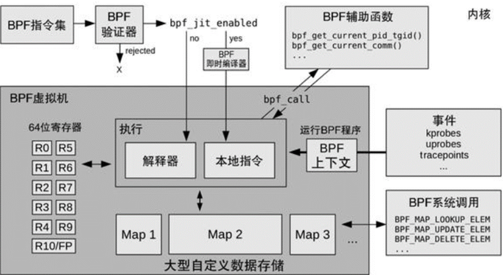
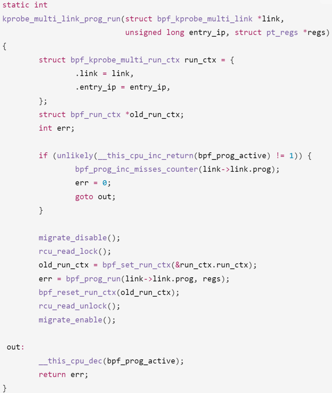
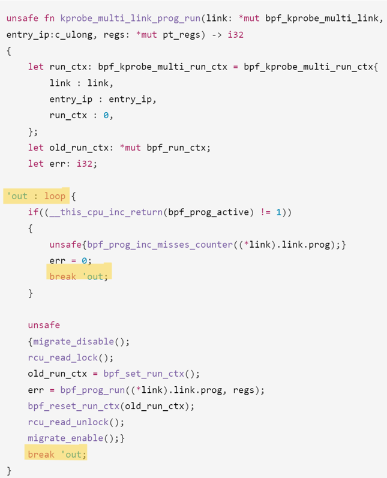
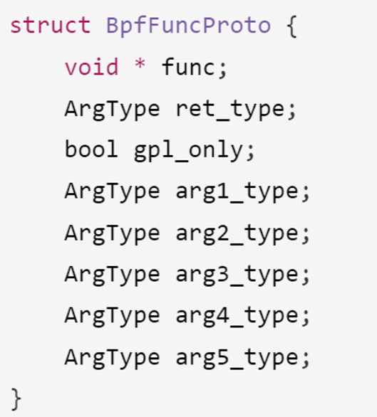
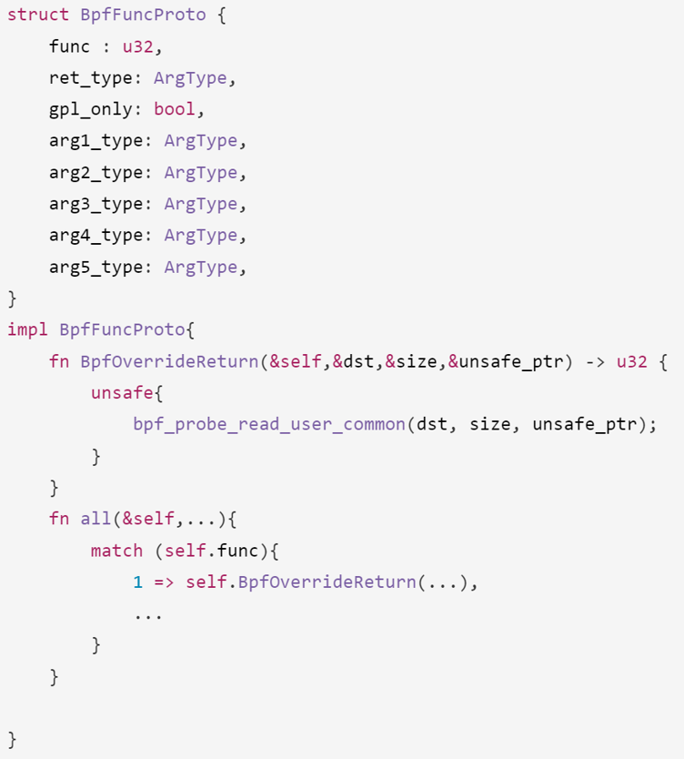
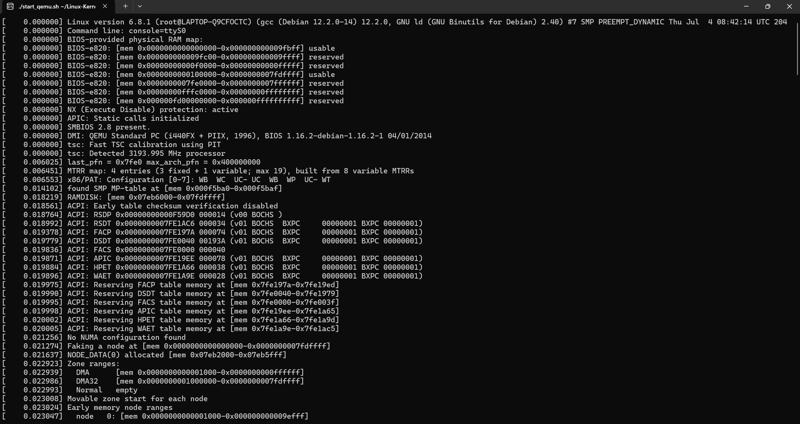
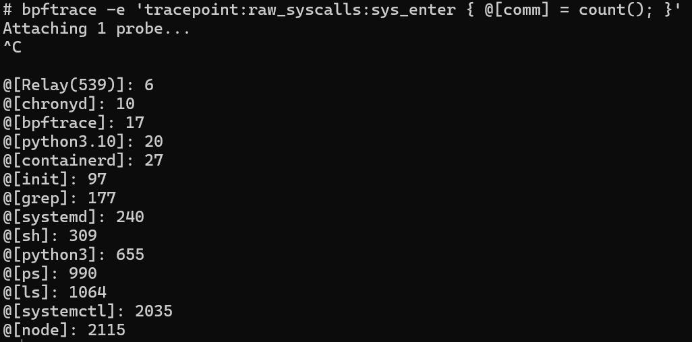
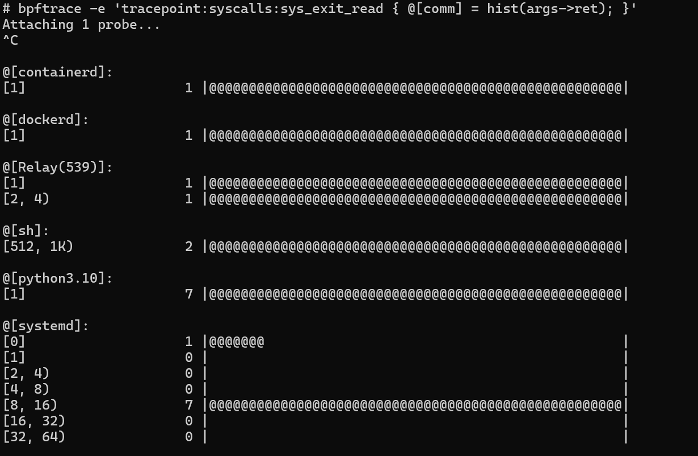
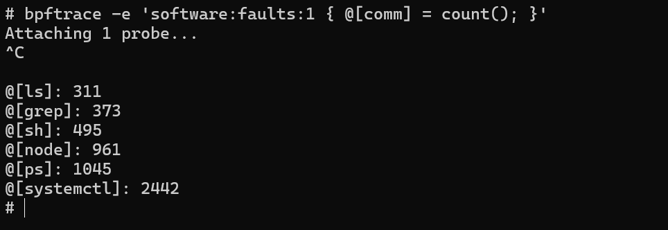
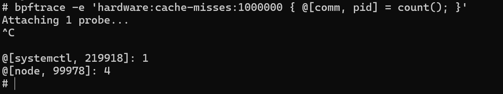

# 关于用Rust改写bpf_trace模块的结题报告
####  mkdir队(组长:潘铂凯 组员:胡揚嘉 金培晟 刘宇恒 王翔辉)

## 目录


- [关于用Rust改写bpf\_trace模块的结题报告](#关于用rust改写bpf_trace模块的结题报告)
      - [mkdir队(组长:潘铂凯 组员:胡揚嘉 金培晟 刘宇恒 王翔辉)](#mkdir队组长潘铂凯-组员胡揚嘉-金培晟-刘宇恒-王翔辉)
  - [目录](#目录)
  - [项目概述](#项目概述)
  - [项目背景和调研](#项目背景和调研)
    - [Linux内核的安全挑战](#linux内核的安全挑战)
    - [Rust改写的优势简介](#rust改写的优势简介)
    - [BPF技术](#bpf技术)
  - [项目介绍](#项目介绍)
    - [bpf\_trace基本功能](#bpf_trace基本功能)
    - [bpf\_trace工作原理](#bpf_trace工作原理)
  - [技术路线介绍](#技术路线介绍)
    - [项目工具介绍](#项目工具介绍)
      - [rustc](#rustc)
      - [Rust 标准库（std）](#rust-标准库std)
      - [libclang](#libclang)
      - [bindgen](#bindgen)
    - [改写依据和基本方法](#改写依据和基本方法)
    - [原C代码整体简介](#原c代码整体简介)
    - [改写思路和改写规则制定](#改写思路和改写规则制定)
      - [从C语言常量宏到Rust语言全局常量](#从c语言常量宏到rust语言全局常量)
      - [Rust调用C语言函数](#rust调用c语言函数)
      - [C语言的条件编译到Rust的cfg](#c语言的条件编译到rust的cfg)
      - [从C语言的goto到Rust的loop和break](#从c语言的goto到rust的loop和break)
      - [从C语言的结构体到Rust的结构体](#从c语言的结构体到rust的结构体)
  - [Rust改写结果分析](#rust改写结果分析)
    - [Rust改写代码整体简介](#rust改写代码整体简介)
    - [部分模块改写展示及功能分析](#部分模块改写展示及功能分析)
    - [bpf\_trace由Rust改写所带来的安全性提升介绍](#bpf_trace由rust改写所带来的安全性提升介绍)
      - [摘要](#摘要)
      - [Rust改写安全性提升简介](#rust改写安全性提升简介)
      - [具体改写安全性提升分析](#具体改写安全性提升分析)
        - [内存安全性](#内存安全性)
        - [并发安全性](#并发安全性)
        - [类型安全](#类型安全)
        - [健全严谨的错误处理机制](#健全严谨的错误处理机制)
        - [生命周期和借用检查](#生命周期和借用检查)
        - [无 NULL 指针带来的安全性提升](#无-null-指针带来的安全性提升)
        - [明确的类型声明和转换](#明确的类型声明和转换)
        - [易于维护且便于阅读的宏系统](#易于维护且便于阅读的宏系统)
        - [显式的 Unsafe 代码块](#显式的-unsafe-代码块)
        - [优秀的迭代器机制和函数式编程特性](#优秀的迭代器机制和函数式编程特性)
        - [有效可靠的模式匹配和错误处理机制](#有效可靠的模式匹配和错误处理机制)
        - [条件编译特性所带来的调试安全性和移植安全性](#条件编译特性所带来的调试安全性和移植安全性)
  - [改写成果功能测试展示](#改写成果功能测试展示)
    - [改写代码编译过程展示](#改写代码编译过程展示)
    - [bpf\_trace功能单行测试展示](#bpf_trace功能单行测试展示)
  - [总结、不足与展望](#总结不足与展望)
    - [工作进展与成员分工](#工作进展与成员分工)
    - [不足与反思](#不足与反思)
    - [未来展望](#未来展望)
  - [鸣谢](#鸣谢)
  - [参考文献](#参考文献)
  - [相关链接](#相关链接)

## 项目概述

BPF（Berkeley Packet Filter）作为一种类Unix系统上用于数据链路层封包收发的原始接口，主要用于在内核中高效地过滤网络数据包，其引入了新的虚拟机（VM）设计和缓存优化这两个主要的革新。同样的，BPFtrace作为一种强大的动态跟踪工具，利用eBPF（Extended Berkeley Packet Filter）技术，为开发者和系统管理员提供了一种高效、灵活的方式来监控和分析内核和用户空间的程序行为。其通过简单但强大的脚本语言，允许用户在不修改程序源代码的情况下收集和分析各种系统和应用程序的运行时信息，从而有效地进行性能调优和问题诊断。

本项目的最终目标，是用rust改写Linux中的bpftrace模块，以提高其安全性、稳定性，并且在这个过程中我们也希望通过这个项目的实践，实现对rust这门语言的深入学习理解和运用。我们希望从对bpftrace模块的改写构建开始，一步步的实现改写模块的编译、测试，实现将rust版本的bpftrace编译进有rust支持的内核，并且实现相同的功能。


**目标**
- 实现对bpf_trace模块的rust改写
- 完成经rust改写后bpf_trace模块的编译
- 用QEMU启动内核，完成对bpf_trace模块相关功能的测试

## 项目背景和调研

### Linux内核的安全挑战
**背景问题：**  Linux系统常用的编程语言为C和C++，这两种语言在内存管理方面依赖于手动操作，缺乏自动内存管理和越界检查机制，这使得它们容易受到缓冲区溢出等安全问题的影响。

**缓冲区溢出的本质：**
1. **内存控制不足：** 在C和C++中，内存的分配、使用和释放都需要程序员手动管理。这种手动操作的方式容易导致内存泄漏、越界访问和双重释放等问题。
2. **缺乏自动内存管理和越界检查：** 与现代高级语言（如Rust、Java等）不同，C和C++没有内置的自动垃圾回收机制，也没有强大的运行时检查来防止越界访问。这使得程序员必须非常小心地编写代码，以避免潜在的安全漏洞。

**典型案例：** Buffer Overflow Attacks
1. **定义：** 缓冲区溢出是指程序在向缓冲区写入数据时，写入了超出缓冲区边界的数据，导致相邻内存区域被覆盖。
2. **后果：** 这种覆盖可能导致数据损坏、信息泄露或执行恶意代码。例如，攻击者可以通过精心构造的数据，覆盖程序的返回地址，从而控制程序的执行流程，执行任意代码。
3. **常见场景：** 缓冲区溢出常见于网络服务、系统守护进程和各种应用程序中，尤其是在处理用户输入或网络数据时。


### Rust改写的优势简介
**(1) 安全性**
Rust通过所有权(Ownership)机制来实现内存安全,并在编译期就能检查出内存错误,从根本上解决了C/C++程序中的内存崩溃、数据竞争等问题

**(2) 并发控制**
Rust提供了线程、消息传递、共享状态等并发编程原语,通过所有权和生命周期(Lifetime)等概念来规避数据竞争,显著降低了并发编程的复杂度

**(3) 零开销抽象**
Rust的编译器在生成高效的机器码方面做了大量优化工作,使得Rust程序几乎可以达到C程序的运行效率,因此完全可以用于撰写性能敏感的系统软件

**(4) WASM支持**
Rust可以被编译为WebAssembly(WASM),使其代码可以在浏览器中运行,为操作系统带来了新的应用场景

### BPF技术
**BPF（Berkeley Packet Filter）**
BPF（Berkeley Packet Filter）是类Unix系统上用于数据链路层封包收发的原始接口。它主要用于在内核中高效地过滤网络数据包。这种技术引入了两个主要的革新：
    
   1. 新的虚拟机（VM）设计：BPF虚拟机采用寄存器结构，能够高效地在现代CPU上运行。BPF程序在这种虚拟机上执行时，可以直接利用寄存器进行操作，提高了数据处理的效率。
   2. 缓存优化：通过BPF，应用程序只复制和过滤数据包相关的数据，避免了不必要的数据处理。这减少了系统开销，提高了数据包处理的速度和效率。


**eBPF技术**
2014年6月，eBPF（extended BPF）技术被引入，扩展了BPF的功能，将其应用范围从内核扩展到用户空间。这一扩展使得BPF不仅可以用于网络数据包过滤，还可以用于系统监控和性能分析，成为BPF技术发展的重要转折点。

eBPF的特点包括：
   1. 灵活性：允许在运行时加载和执行用户定义的程序，而无需重新编译内核。
   2. 安全性：内核中的eBPF验证器在加载字节码之前会检查其安全性，防止恶意代码的执行。

**BPF编译、加载和运行**

如图所示，BPF程序的编译、加载和运行过程如下：

1. **编译：**

    用户编写的BPF程序通过LLVM/Clang编译器生成LLVM IR（中间表示）文件。
进一步生成BPF字节码，这些字节码是eBPF程序在内核中运行的指令。

2. **加载：**

    生成的BPF字节码通过`bpf_load_prog()`系统调用加载到内核中。
内核中的BPF验证器会对字节码进行检查，确保其安全性和正确性。如果验证通过，字节码将被加载并准备执行。
3. **执行：**

    加载到内核中的BPF字节码可以通过两种方式执行：解释执行或即时编译（JIT）。

4. **解释执行：** 直接在BPF虚拟机中逐条解释和执行字节码指令。

5. **JIT编译：** 将BPF字节码即时编译为本地机器码，提高执行效率。

**为什么使用bpftrace？**
    直接通过BPF指令编写BPF程序非常复杂，因此需要一个高级语言支持的BPF前端：bpftrace。bpftrace提供了类似AWK的高级脚本语言，使用户能够轻松编写和执行复杂的系统监控脚本，无需深入了解BPF的底层实现细节。
## 项目介绍
BPFtrace是一种强大的动态跟踪工具，利用eBPF（Extended Berkeley Packet Filter）技术，为开发者和系统管理员提供了一种高效、灵活的方式来监控和分析内核和用户空间的程序行为。该工具通过简单但强大的脚本语言，允许用户在不修改程序源代码的情况下收集和分析各种系统和应用程序的运行时信息，从而有效地进行性能调优和问题诊断。
### bpf_trace基本功能

1. **内核和程序信息采集**

    BPFtrace利用eBPF技术和BCC（BPF Compiler Collection）库，高效地采集内核和程序运行时的信息。通过这种方式，BPFtrace可以深入系统内部，收集包括CPU使用情况、内存分配、I/O操作等在内的多种数据。这种能力使得用户能够详细了解系统和应用 程序的运行状况，快速发现性能瓶颈和异常行为。
    应用场景：系统管理员可以使用BPFtrace监控服务器的CPU和内存使用情况，及时发现 并解决性能问题。

2. **探针机制**

    BPFtrace通过探针机制轻量级地监控系统和应用程序。探针是一种特殊的断点，可以插入到内核或用户空间的代码路径中，用于捕获和记录运行时的特定事件。BPFtrace支持多种类型的探针，包括kprobes（内核函数探针）、uprobes（用户函数探针）和tracepoints（静态跟踪点），从而实现全面的系统监控。
    应用场景：开发者可以利用探针监控特定函数的调用次数和执行时间，以优化代码性能。

3. **高级跟踪语言**

    BPFtrace提供了一种类似于awk和C的高级跟踪语言，使用户能够编写复杂的脚本来定义跟踪逻辑。这种脚本语言具有强大的表达能力，支持变量、数组、条件语句和循环等语法结构，使得用户可以根据具体需求灵活地定制跟踪任务。
    应用场景：工程师可以编写脚本跟踪某个特定应用程序的资源使用情况，并根据数据分析结果进行优化。

4. **LLVM后端编译**

    BPFtrace使用LLVM作为后端，将用户编写的脚本编译为eBPF字节码。LLVM是一种强大的编译器基础设施，它能够生成高效的机器码，从而确保BPFtrace脚本在执行时具有良好的性能和低开销。
    应用场景：由于LLVM编译器的高效性，BPFtrace可以在生产环境中使用，而不会显著影响系统性能。

5. **灵活的脚本执行**

    BPFtrace支持灵活的脚本编写和执行，适应不同的跟踪需求。用户可以根据实际需求动态加载和卸载脚本，无需重启系统或应用程序。这种灵活性使得BPFtrace非常适合用于实时监控和故障排查。
    应用场景：运维人员可以在系统运行过程中，实时加载不同的BPFtrace脚本，监控系统健康状况并及时响应突发事件。

6. **低性能开销**

    BPFtrace通过轻量级的探针机制和高效的eBPF字节码执行，实现低性能开销。eBPF字节码在内核中执行时，经过严格的验证和优化，确保其运行时开销极小，对系统性能影响微乎其微。
    应用场景：在高负载的生产环境中，BPFtrace的低开销特性使得它可以长时间运行，而不会对系统的整体性能造成显著影响。
### bpf_trace工作原理


bpftrace通过用户编写的脚本实现对系统和应用程序行为的监控和分析。如图所示，bpftrace的工作包括下述几个部分：

1. **程序启动**
    bpftrace程序通过`main.*`和`bpftrace.*`文件启动，加载用户编写的bpftrace脚本。启动时，程序首先解析和验证输入的脚本，确保其语法正确，然后将其转换为抽象语法树（AST）进行进一步处理。

2. **解析器**
    解析器是bpftrace将用户脚本转换为抽象语法树的关键组件。主要包括以下几个部分：

    `driver.l`：驱动整个解析过程，协调各个解析器模块的工作。
    `lexer.l`：执行词法分析，将输入的bpftrace脚本分解为基本的语法单元（token）。这些token是脚本中的最小语法元素，如关键字、操作符和标识符。
    `parser.yy`：进行语法分析，将词法分析生成的token按照bpftrace的语法规则组织成抽象语法树（AST）。AST是脚本的结构化表示，体现了脚本的逻辑结构和执行顺序。

3. **抽象语法树（AST）**    
    抽象语法树（AST）是bpftrace脚本的中间表示形式，展示了脚本中的各个指令及其相互关系。AST由语法树解析器（`_parser.*`）处理，将脚本的高层次结构和逻辑表达出来。AST节点表示脚本中的各种操作和指令，通过这种结构化表示，后续的代码生成和优化过程能够更高效地进行。

4. **语法分析器**
    语法分析器（`ast/semantic_analyser.*`）对AST进行语法和语义检查，确保脚本没有语法错误和语义冲突。同时，语法分析器还负责创建映射（maps）和添加探针（probes）。映射用于存储跟踪过程中收集的数据，而探针则用于插入到内核或用户空间的代码路径中，以捕获特定的事件和操作。

5. **代码生成器**
    代码生成器（`ast/codegen_llvm.*`）将AST节点转换为LLVM中间表示（IR）。LLVM IR是一种低级中间语言，能够表达复杂的程序逻辑，同时便于进一步的优化和转换。代码生成器根据AST的结构生成相应的LLVM IR代码，这些代码将进一步转换为BPF字节码。

6. **中间形式构建器**
    中间形式构建器（`ast/irbuilderbpf.*`）将LLVM IR转换为BPF字节码。BPF字节码是一种高效的字节码格式，可以直接在内核中执行。中间形式构建器的任务是将高层次的LLVM IR指令映射到低层次的BPF指令集，确保生成的字节码能够在内核中高效、安全地运行。

7. **BPF字节码加载**
    生成的BPF字节码通过`bpf_load_prog()`函数加载到内核中。在加载过程中，内核中的BPF验证器会对字节码进行检查，确保其安全性和正确性。这包括验证字节码的合法性、检测潜在的安全漏洞以及确保字节码不会对系统的稳定性造成威胁。

8. **内核中的BPF**
    加载到内核中的BPF字节码负责处理各种事件。主要包括以下几种事件类型：

    `tracepoints`：内核中的静态跟踪点，用于捕获特定的系统事件。
    `kprobes`：内核函数探针，用于捕获内核函数的调用和返回。
    `uprobes`：用户空间函数探针，用于捕获用户空间应用程序的函数调用和返回。
    `perf_events`：性能事件，用于监控和分析系统性能。

9. **映射表和缓冲区**
    BPF程序将收集到的数据存储在映射表（maps）和perf缓冲区中。映射表是键值对存储结构，用于保存跟踪过程中收集的各种数据，如计数器、统计信息等。perf缓冲区用于高频率事件的数据缓存，便于用户空间程序高效地读取和处理这些数据。

10. **数据输出**
    bpftrace程序从映射表和perf缓冲区中读取数据，通过`print_map()`和`perf_event_printer()`函数将结果输出给用户。数据输出可以是标准输出、日志文件或其他用户定义的输出格式。这些输出数据可以用于实时监控、问题诊断和性能分析。
## 技术路线介绍

### 项目工具介绍
#### rustc
rustc 是 Rust 编程语言的编译器。它负责将 Rust 代码编译成可执行文件或其他类型的二进制文件。在编译过程中，rustc 会检查代码中的错误和潜在问题，并提供错误信息和警告。rustc 还支持交叉编译，从而可以在一个平台上编译代码，生成另一个平台上运行的可执行文件。同时 rustc 提供了多种编译选项，并且Rust 允许在代码中使用属性来控制 rustc 的行为，可以根据需要优化生成的代码。
#### Rust 标准库（std）
Rust 标准库（std）是 Rust 编程语言的核心部分，提供了一系列预定义的功能，如数据类型、I/O 操作、并发编程工具等，这些功能对于日常的 Rust 开发来说是不可或缺的。这个标准库具有以下特点：

1. 丰富的数据类型：标准库提供了多种基本数据类型和复合数据类型，如 Vec<T>、HashMap<K, V> 等，这些类型是高效、安全编程的基础。

2. 错误处理：Rust 标准库中包含了错误处理机制，如 Result<T, E> 和 Option<T> 枚举，它们是 Rust 错误处理和可选值处理的核心。

3. 并发编程：标准库提供了多种并发编程工具，包括线程、通道（channels）、互斥锁（Mutex）等，这些工具帮助开发者构建高效且安全的并发应用。

4. I/O 和网络：标准库中的 std::io 模块提供了一系列进行输入和输出操作的功能，std::net 模块则提供了网络编程的相关功能。

5. 平台抽象和兼容性：Rust 标准库对不同操作系统平台的底层细节进行了抽象，使得 Rust 代码可以在多种平台上编译和运行，同时保持高度的兼容性和性能。
#### libclang
libclang 是 LLVM 项目的一部分，提供了对 Clang 编译器前端的 C 接口。以下是其特点：

1. 源代码解析：libclang 提供了解析 C、C++、Objective-C 和 Objective-C++ 源代码的能力，使得开发者可以构建自定义的静态分析工具、代码编辑器插件或者代码浏览器。

2. 抽象语法树（AST）：通过 libclang，开发者可以访问源代码的抽象语法树（AST）。AST 是源代码的树状表示，展示了代码的结构和语法元素之间的关系，这对于进行复杂的代码分析和转换非常有用。

3. 跨平台：libclang 支持多个平台，包括 Windows、Linux 和 macOS。这意味着使用 libclang 开发的工具可以在多个操作系统上运行。

4. 工具支持：libclang 是许多流行开发工具背后的驱动力，例如代码编辑器中的语法高亮、代码补全、代码导航等功能。例如，一些基于 libclang 的工具可以提供准确的代码补全建议，甚至在代码尚未编译的情况下也能做到。

5. 易于使用的 API：尽管 libclang 是用 C 语言编写的，它提供了一套易于使用的 API，使得开发者可以方便地集成和使用 Clang 的强大功能。
#### bindgen
bindgen 是一个 Rust 工具，用于自动生成 Rust 绑定到 C 和 C++ 代码的库。它利用 libclang 来解析头文件，从而生成 Rust 代码，使得 Rust 程序能够安全地调用 C 或 C++ 代码。以下是其主要特点：

1. 自动化生成绑定：bindgen 自动化地从 C 或 C++ 的头文件生成 Rust 绑定，极大地简化了在 Rust 代码中使用 C/C++ 库的过程。

2. 类型安全：生成的绑定尽可能地保持类型安全，使得在 Rust 中调用 C/C++ 代码时能够享受到 Rust 的类型安全保证。

3. 自定义化：虽然 bindgen 的默认行为适用于许多场景，但它也提供了丰富的命令行选项和属性，允许开发者根据需要自定义生成的绑定。

4. 跨平台：bindgen 支持生成可以在多个平台上使用的绑定，包括但不限于 Windows、Linux 和 macOS。

5. 集成 libclang：bindgen 使用 libclang 来解析 C/C++ 的头文件，这意味着它可以处理复杂的语言特性和宏。
### 改写依据和基本方法
改写依据是bpf_trace.c以及其依赖的头文件。基本方法是先整体阅读一遍代码，大致了解代码的功能和结构，发现代码结构基本呈现**函数定义+结构体**这一种模式，然后逐个**函数+结构体块**进行改写。
### 原C代码整体简介
bpf_trace.c定义了大量的bpf_trace的编程函数，这些函数用于帮助用户编写BPF程序，并且能够极大简化这一过程。这些函数包括对BPF程序的加载、卸载、运行、调试等操作。bpf_trace.c还定义了一些结构体，用于存储BPF程序的信息。

以下是内置变量表：


**具体函数解析**：


- 输入：

char *fmt：格式化字符串，指定如何格式化输出

u32 fmt_size：格式化字符串的大小

u64 arg1，u64 arg2，u64 arg3

- 输出：

int：格式化字符串的长度或错误码

- 功能：

格式化输出调试信息，并将其写入到调试日志中

### 改写思路和改写规则制定
#### 从C语言常量宏到Rust语言全局常量
在C语言中，常量宏是通过预处理器指令#define来定义的。它们在编译前被替换到代码中每一个使用它们的地方。

**优点**：
- 简单易用，可以在不改变代码逻辑的情况下快速修改值。

**缺点**:
- 类型不安全，因为预处理器只是简单地文本替换，不进行类型检查。

Rust通过const关键字或静态生命周期的static关键字来定义全局常量。

**优点**：
- 类型安全，Rust的编译器会检查常量的类型。
- 可以定义复杂类型的常量，而不仅仅是基本类型。
- const定义的常量在编译时就被评估，不占用运行时内存；static定义的常量在程序的整个运行期间都存在。

**缺点**:
- 相比C语言宏，学习曲线稍微陡峭，需要理解Rust的内存管理和所有权模型。

**改写示例**：

C语言中的常量宏：
```c
#define EOVERFLOW 1
```
改写为：
```rust
static EOVERFLOW: i32 = 1;
```
#### Rust调用C语言函数
通过 extern "C" 声明后结合 unsafe 关键字，可以在Rust中调用C语言函数。

**改写示例**：

C语言代码：
```c
if(sleepable)
    rcu_read_lock_trace();
else 
    rcu_read_lock();
```
改写为：
```rust
extern "C" {
    fn rcu_read_lock_trace();
    fn rcu_read_lock();
}
unsafe {
    if sleepable {
        rcu_read_lock_trace();
    } else {
        rcu_read_lock();
    }
}
```
#### C语言的条件编译到Rust的cfg
C语言中的条件编译是通过预处理器指令 #ifdef 和 #endif 来实现的。在Rust中，可以使用 cfg 属性来实现条件编译。

**cfg的优势**：

Rust的cfg属性是语言的一部分，编译器会检查条件编译的代码，确保即使代码未被编译执行，也符合Rust的类型安全要求。而C语言的预处理器仅进行文本替换，不会进行类型检查。

**改写示例**：

C语言代码：
```c
#ifdef CONFIG_BPF_KPROBE_OVERRIDE
    // some code
#endif
```
改写为：
```rust
#[cfg(CONFIG_BPF_KPROBE_OVERRIDE)]
{
    // some code
}
```
#### 从C语言的goto到Rust的loop和break
C语言中的goto语句是一种无条件跳转语句，可以直接跳转到代码中的任意位置。Rust中没有goto语句，但可以通过loop和break语句来实现同样的功能。

**改写示例**：

C语言代码：



Rust语言代码：



#### 从C语言的结构体到Rust的结构体
这里的改写不仅将C语言的结构体改写为Rust的结构体，还会将其中包含的函数体指针一并用impl块实现。

**改写示例**：

C语言代码：



Rust语言代码：



## Rust改写结果分析

### Rust改写代码整体简介
由于bpf_trace.c中的结构较为清晰，因此在改写过程中，我们将每个函数+结构体块分别进行改写，将C语言的常量宏改写为Rust的全局常量，将C语言的条件编译改写为Rust的cfg属性，将C语言的goto语句改写为Rust的loop和break语句，将C语言的结构体改写为Rust的结构体。

### 部分模块改写展示及功能分析

```rust
fn bpf_trace_vprintk(fmt: &str, fmt_size: u32, args: *const u64, data_len: u32) -> i32 {
    let mut data = BpfBprintfData {
        get_bin_args: true,
        get_buf: true,
        buf: Vec::new(),
        bin_args: Vec::new(),
    };

    if data_len as usize % 8 != 0 || data_len as usize > MAX_BPRINTF_VARARGS * 8 || (data_len > 0 && args.is_null()) {
        return EINVAL;
    }
    let num_args = (data_len / 8) as usize;

    let ret = unsafe{bpf_bprintf_prepare(fmt, fmt_size, args, num_args, &mut data)};
    if ret < 0 {
        return ret;
    }

    let ret = unsafe{bstr_printf(&mut data.buf, MAX_BPRINTF_BUF, fmt, &data.bin_args)};
    unsafe{trace_bpf_trace_printk(&data.buf)};

    ret
}
```

这个函数bpf_trace_vprintk在bpf-trace中的功能是格式化并打印跟踪信息。它通过以下步骤实现：

1. 初始化数据结构：首先，它创建一个BpfBprintfData结构体实例，用于存储格式化打印所需的信息，包括二进制参数和缓冲区。

2. 参数校验：接着，函数检查传入的参数长度是否符合要求（即长度是8的倍数，不超过最大允许的参数个数，且如果长度大于0，参数指针不为null）。如果不符合，函数返回EINVAL（一个错误码，表示无效的参数）。

3. 准备格式化打印：通过调用bpf_bprintf_prepare函数，准备格式化打印的数据。这个步骤涉及解析格式字符串和参数，准备好要打印的数据。

4. 执行格式化打印：然后，使用bstr_printf函数将格式化的数据写入缓冲区。

5. 打印信息：最后，通过trace_bpf_trace_printk函数将缓冲区中的数据打印到跟踪日志中。

### bpf_trace由Rust改写所带来的安全性提升介绍
#### 摘要
本部分主要探讨了将 Linux 内核中的 bpf_trace 模块从 C 语言改写为 Rust 语言所带来的安全性提升。通过分析 Rust 语言的诸多特性,如所有权系统、生命周期管理、类型系统、错误处理、并发安全、无 NULL 指针等,结合我们小组改写后具体的代码示例,阐述了 Rust 改写在内存安全、类型安全、异常安全、线程安全、可读性和可维护性等方面的优势。我们一致认为,尽管 Rust 改写可能带来一定的学习成本和编程复杂度,但其对系统稳定性和可靠性的提升是显著的,值得在实践中不断探索和优化。

#### Rust改写安全性提升简介
Rust 是一种系统级编程语言,其设计目标是提供与 C/C++ 相当的性能,同时通过强大的类型系统和所有权机制来保证内存安全和线程安全。相比于 C 语言,Rust 在安全性方面有诸多优势。

首先,Rust 通过所有权系统、借用检查器和生命周期来防止常见的内存相关错误,如空指针解引用、缓冲区溢出和悬垂指针等问题。Rust 的所有权系统确保每个值都有一个明确的所有者,同时限制了值的复制和移动。借用检查器则确保了在任何给定时间内,要么只有一个可变引用,要么有多个不可变引用,从而避免了数据竞争。Rust 的生命周期机制可以防止悬垂引用,确保引用的有效性。这些特性使得 Rust 程序在编译时就能发现大部分内存错误,大大提高了内存安全性。

其次,Rust 提供了强大的类型系统和严格的类型检查。Rust 的类型系统支持泛型、trait 和类型推断等特性,可以在编译时捕获类型相关的错误。Rust 还提供了 Option 和 Result 等类型来显式处理空值和错误,避免了未定义行为。Rust 的类型系统确保了程序的类型安全,减少了运行时错误。

再者,Rust 提供了安全的并发机制。Rust 的所有权系统和类型系统可以在编译时防止数据竞争,确保线程安全。Rust 提供了 Send 和 Sync 等 trait 来标记类型的线程安全性,编译器会自动检查并发安全。Rust 还提供了安全的并发原语,如 Arc 和 Mutex,以及 async/await 异步编程模型,方便开发者编写高效且安全的并发程序。

此外,Rust 还有许多其他的安全特性。例如,Rust 有严格的变量初始化检查,避免了未初始化的变量。Rust 的 match 表达式要求穷尽所有可能性,避免了遗漏情况。Rust 的 unsafe 关键字可以明确标记不安全的代码块,方便审计和维护。Rust 丰富的错误处理机制和表达式风格的返回值也提高了代码的安全性和可读性。

总体来看,Rust 通过其独特的所有权系统、类型系统、并发安全机制和其他安全特性,提供了一种安全、高效、并发友好的系统级编程语言。将 Linux 内核中的关键模块(如 bpf_trace)从 C 语言改写为 Rust,可以从根本上提高内核的内存安全、类型安全和线程安全,减少内核漏洞,提升系统的稳定性和可靠性。

#### 具体改写安全性提升分析
##### 内存安全性
   >Rust 通过所有权系统、借用检查器和生命周期来防止常见的内存相关错误,如空指针解引用、缓冲区溢出和悬垂指针等问题。Rust 通过确保内存安全性，使得并发程序更加稳定可靠。与传统的系统编程语言如 C 或 C++ 相比，Rust 不仅减少了安全漏洞的风险，还提供了更细粒度的控制来优化程序性能。

例如,我们小组在BpfBprintfData模块中使用了 Rust 的 `Vec<u8>` 类型来替代原始的裸指针,从而避免了手动内存管理可能带来的内存泄漏和缓冲区溢出等问题。

```rust
struct BpfBprintfData {
    get_bin_args: bool,
    get_buf: bool,
    buf: Vec<u8>, // 使用Vec<u8>作为缓冲区
    bin_args: Vec<u64>, // 假设参数是u64类型的数组
}
```

再如,在bpf_probe_write_user模块中,我们使用了 Rust 的 `NonNull` 类型来替代原始的裸指针,以确保指针始终是非空的,避免了空指针解引用的风险。

```rust
fn bpf_probe_write_user(unsafe_ptr:NonNull<c_void>,src:NonNull<c_void>,size:u32)->i32{
    unsafe{
        let in_interrupt_var = in_interrupt() as bool;
        let unlikely_var = unlikely(in_interrupt_var||current->flags & (PF_KTHREAD | PF_EXITING)) as bool;
        if unlikely_var{
            return -EPERM;
        }
        let nmi_uaccess_okay_var = nmi_uaccess_okay() as bool;
        let unlikely_var1 = unlikely(!nmi_uaccess_okay_var) as bool;
        if unlikely_var1{
            return -EPERM;
        }
        let copy_to_user_nofault_var=copy_to_user_nofault(unsafe_ptr.as_ptr(), src.as_ptr(), size);
    }
    copy_to_user_nofault_var
}
```

##### 并发安全性
   >Rust语言通过其独特的所有权和借用机制在编译阶段消除数据竞争，显著提高了程序的安全性和效率。在Rust中，每个变量都有一个明确的所有者，并且在任何时刻内，要么只允许存在一个可变引用，要么允许存在多个不可变引用。这样的设计有效预防了状态不一致和竞争条件的发生，从根本上在编译时而非运行时解决了并发中的安全问题，如数据竞争和迭代器失效等,并且Rust的线程安全保证和无锁编程特性使其在并发执行效率上优于C++。这一点对于需要高并发处理的Linux内核模块开发尤为重要，能有效提高系统的稳定性和响应速度。

例如,我们小组在改写以下代码过程中使用了 Rust 的 `Mutex` 来保护全局的 `BPF_TRACE_MODULES` 链表,确保多线程访问时的数据一致性和线程安全性。

```rust
lazy_static! {
    static ref BPF_TRACE_MODULES: Mutex<LinkedList<BpfTraceModule>> = Mutex::new(LinkedList::new());
}
```

此外，在使用 Rust 进行改写的过程中，可以使用 Rust 的并发原语,如原子操作和互斥锁,来确保线程安全和避免数据竞争。例如我们在下面展示的代码段中使用了 `PerCpu` 类型和原子操作来管理每个 CPU 的嵌套级别,确保了并发访问的安全性。


```rust
static BPF_EVENT_OUTPUT_NEST_LEVEL: PerCpu<i32> = PerCpu::new();

fn bpf_event_output(map: NonNull<bpf_map>, flags: u64, meta: NonNull<c_void>, meta_size: u64, ctx: NonNull<c_void>, ctx_size: u64, ctx_copy: bpf_ctx_copy_t) -> u64 {
    // ...
    let mut nest_level: i32 = this_cpu_inc_return(bpf_event_output_nest_level);
    // ...
    this_cpu_dec(&BPF_EVENT_OUTPUT_NEST_LEVEL);
    // ...
}
```


##### 类型安全
   >Rust 拥有强大的类型系统,在改写过程中可以使用 Rust 的类型系统来增强类型安全,避免类型混淆和错误的类型转换,编译器会在编译期对类型进行严格的检查,避免了很多运行时错误。

例如,在以下代码中,我们使用了 Rust 的枚举类型 `RetType` 和 `ArgType` 来替代原始的整数常量,提高了代码的可读性和可维护性,同时也避免了使用错误的常量值导致的逻辑错误。

```rust
pub struct BpfFuncProto {
    func: fn() -> (),
    gpl_only: bool,
    ret_type: RetType,
    arg1_type: ArgType,
    arg2_type: ArgType,
}

pub enum RetType {
    RetInteger,
    // 其他返回类型
}

pub enum ArgType {
    ArgPtrToMem,
    ArgConstSize,
    // 其他参数类型
}
```

再比如下面这个我们小组改写的函数中,通过比较 `size` 参数与 `bpf_perf_event_value` 结构体的大小,确保了类型的匹配。如果类型不匹配,则返回错误,从而避免了类型混淆,提升了函数代码的安全性。
```rust
fn bpf_perf_prog_read_value(
    ctx: *mut bpf_perf_event_data_kern,
    buf: *mut bpf_perf_event_value,
    size: u32,
) -> i32 {
    // 检查提供的size是否与`bpf_perf_event_value`结构体大小相等
    if size as usize != mem::size_of::<bpf_perf_event_value>() {
        // 如果不相等，清空buf并返回错误码
        ptr::write_bytes(buf as *mut u8, 0, size as usize);
        return -EINVAL;
    }

    // 调用假设的外部函数`perf_event_read_local`
    let err = perf_event_read_local((*ctx).event, &mut (*buf).counter, &mut (*buf).enabled, &mut (*buf).running);

    if err != 0 {
        // 如果调用失败，清空buf并返回错误码
        ptr::write_bytes(buf as *mut u8, 0, size as usize);
        return err;
    }

    0 // 成功执行
}
```

另一个例子是我们小组在定义 `bpf_raw_event_map` 结构体时,使用 Rust 的字段类型来确保类型安全。其中,`bpf_func` 字段使用了 `Option` 类型和 `unsafe extern "C" fn` 函数指针类型,确保了函数指针的类型安全和可空性。

```rust
struct bpf_raw_event_map {
    tp: *mut tracepoint,
    bpf_func: Option<unsafe extern "C" fn(ctx: *mut c_void, ...) -> i32>,
    num_args: u32,
    writable_size: u32,
}
```

##### 健全严谨的错误处理机制
   >Rust 提供了 `Result` 和 `Option` 等类型来显式地处理错误和可能为空的值,避免了忽略错误或者未检查空值导致的问题。

例如,在以下代码中,我们使用了 `io::Result<()>` 类型作为函数的返回值,明确地告知调用者这个函数可能会出现 I/O 错误,需要妥善处理,并且其使用 `?` 运算符来传播错误,确保错误得到妥善处理。
```rust
fn set_printk_clr_event() -> io::Result<()> {
    /*
     * This program might be calling bpf_trace_printk,
     * so enable the associated bpf_trace/bpf_trace_printk event.
     * Repeat this each time as it is possible a user has
     * disabled bpf_trace_printk events.  By loading a program
     * calling bpf_trace_printk() however the user has expressed
     * the intent to see such events.
     */
    if trace_set_clr_event("bpf_trace", "bpf_trace_printk", 1)? {
        writeln!(io::stderr(), "could not enable bpf_trace_printk events");
    }
    Ok(())
}
```


再如,我们在bpf_get_probe_write_proto模块中使用了 `Option` 类型来包装 `bpf_probe_write_user_proto`,表明这个值可能为 `None`,需要在使用时进行检查和处理。

```rust
fn bpf_get_probe_write_proto() -> Option<&'static BpfFuncProto> {
    // 检查是否具有 CAP_SYS_ADMIN 权限
    if !capable(CAP_SYS_ADMIN) {
        return None;
    }

    // 输出警告信息,提示正在安装可能损坏用户内存的程序
    pr_warn_ratelimited!(
        "{} is installing a program with bpf_probe_write_user helper that may corrupt user memory!",
        format!("{}[{}]", current().comm(), current().pid())
    );

    // 返回 bpf_probe_write_user_proto 的不可变引用
    Some(&BPF_PROBE_WRITE_USER_PROTO)
}
```

##### 生命周期和借用检查
   >Rust 通过生命周期和借用检查来确保内存的安全访问,避免了悬垂指针、重复释放等问题。

例如,我们小组在以下代码中使用了 `&'static BpfFuncProto` 类型作为函数的返回值,明确地告知调用者返回的是一个指向静态生命周期数据的不可变引用,从而避免了悬垂指针的风险。

```rust
fn bpf_get_trace_printk_proto() -> &'static BpfFuncProto {
    set_printk_clr_event();
    unsafe { &BPF_TRACE_PRINTK_PROTO }
}
```

另一个我们小组在 Rust 改写中与之相关的例子是在 `bpf_kfunc` 模块中使用 `BpfKey` 结构体来管理密钥的生命周期,通过在 `BpfKey` 结构体中记录是否持有引用,并在 `bpf_key_put` 函数中根据该字段决定是否需要释放密钥,可以避免密钥的重复释放或悬垂指针问题。

```rust
pub struct BpfKey {
    key: *mut c_void,
    has_ref: bool,
}

pub unsafe fn bpf_key_put(bkey: *mut BpfKey) {
    if (*bkey).has_ref {
        key_put((*bkey).key);
    }
    kfree(bkey as *mut c_void);
}
```


##### 无 NULL 指针带来的安全性提升
   >在 Rust 改写中,默认情况下所有引用都是非空的,因此可以避免 NULL 指针解引用的问题,使用 Rust 的所有权系统可以从一定程度上避免内存安全问题,如空指针解引用、悬垂指针等。


例如,在以下几处代码中,我们小组使用了 `NonNull` 类型来包装指针,确保它们始终是非空的,这里使用了 `NonNull` 类型来确保指针的非空性,避免了空指针解引用的风险。

```rust
fn bpf_probe_write_user(unsafe_ptr:NonNull<c_void>,src:NonNull<c_void>,size:u32)->i32{
    unsafe{
        let in_interrupt_var = in_interrupt() as bool;
        let unlikely_var = unlikely(in_interrupt_var||current->flags & (PF_KTHREAD | PF_EXITING)) as bool;
        if unlikely_var{
            return -EPERM;
        }
        let nmi_uaccess_okay_var = nmi_uaccess_okay() as bool;
        let unlikely_var1 = unlikely(!nmi_uaccess_okay_var) as bool;
        if unlikely_var1{
            return -EPERM;
        }
        let copy_to_user_nofault_var=copy_to_user_nofault(unsafe_ptr.as_ptr(), src.as_ptr(), size);
    }
    copy_to_user_nofault_var
}
//----------------------------------------------------------------------------------
//----------------------------------------------------------------------------------
fn bpf_event_output(map:NonNull<bpf_map>, flags:u64 , meta:NonNull<c_void>, meta_size:u64 ,ctx:NonNull<c_void>, ctx_size:u64 , ctx_copy:bpf_ctx_copy_t )->u64{
    let frag= perf_raw_frag{
        copy: ctx_copy,
        size: ctx_size,
        data: ctx.as_ptr(),
    };
    struct PerfRawRecord {
        frag: PerfRawFrag,
    }
    
    // 假设frag已经被正确地定义和初始化
    let raw = PerfRawRecord {
        frag: PerfRawFrag {
            next: if ctx_size > 0 { Some(&frag as *const _) } else { None },
            size: meta_size,
            data: meta as *const u32, // 假设meta可以被转换为*const u8
        },
    };
    let mut sd = NonNull<perf_sample_data>;
    let mut regs = NonNull<pt_regs>;
    preempt_disable();
    let mut nest_level : i32= this_cpu_inc_return(bpf_event_output_nest_level);
    if WARN_ON_ONCE(nest_level as usize > ARRAY_SIZE ){
        // 错误处理，使用Result返回错误
        this_cpu_dec(&BPF_EVENT_OUTPUT_NEST_LEVEL);
        preempt_enable();
        return Err(-EBUSY);
    }

    let sd = this_cpu_ptr(&BPF_MISC_SDS.sds[nest_level - 1]);
    let regs = this_cpu_ptr(&BPF_PT_REGS.regs[nest_level - 1]);

    perf_fetch_caller_regs(regs);
    perf_sample_data_init(sd, 0, 0);
    perf_sample_save_raw_data(sd, &raw);

    let ret = __bpf_perf_event_output(regs, map.as_ptr(), flags, sd)?;

    // 正确的退出点
    this_cpu_dec(&BPF_EVENT_OUTPUT_NEST_LEVEL);
    preempt_enable();
    Ok(ret)
}
```

##### 明确的类型声明和转换
>在使用 Rust 进行改写时,可以使用 Rust 的类型系统来增强类型安全,以避免类型混淆和错误的类型转换。

例如在下面的bpf_current_task_under_cgroup模块中,我们小组使用了 Rust 的类型系统,从而确保了类型的正确性和一致性，比如这里使用了明确的类型转换,如 `container_of` 和 `as` 关键字,来确保类型的正确性。
```rust
fn bpf_current_task_under_cgroup(map: NonNull<bpf_map>,idx: u32) -> i64 {
    unsafe{
        let array: NonNull<bpf_array> = container_of(map.as_ptr(), bpf_array, map.as_ptr());
        if unlikely(idx >= array.map.max_entries) {
            return -E2BIG;
        }
        let cgrp : cgroup = READ_ONCE(array.ptrs[idx]);
        if unlikely(!cgrp) {
            return -EAGAIN;
        }
        return task_under_cgroup_hierarchy(current, cgrp);
    }
}
```

##### 易于维护且便于阅读的宏系统
>在使用 Rust 进行改写时,使用 Rust 的宏系统来封装和简化常见的模式和操作,提高代码的可读性和可维护性。

例如在下面展示的代码段中，我们小组在改写过程中使用了宏来定义和生成 `bpf_get_current_task` 函数,简化了代码的编写和维护。这个宏定义了一个通用的 BPF 调用函数模板,可以根据具体的函数名和参数类型生成相应的函数定义,减少了重复代码,提高了代码的可维护性。


```rust
macro_rules! BPF_CALL_0 {
    ($func:ident) => {
        #[no_mangle]
        pub extern "C" fn $func() -> i64 {
            // 将 current 转换为 i64 类型并返回
            current as i64
        }
    };
}

BPF_CALL_0!(bpf_get_current_task);
```

##### 显式的 Unsafe 代码块
   >在 Rust 中,不安全的操作必须显式地使用 `unsafe` 关键字标记,如裸指针的解引用和类型转,这提醒开发者谨慎处理这些代码,并对其正确性负责。其可以明确标记和隔离不安全的操作,提高代码的可审计性和可维护性，从而提高代码的安全性。

例如,在以下代码中,我们小组使用了 `unsafe` 块来包裹不安全的指针解引用操作,明确标记了代码中的不安全区域,提高了代码的可读性和可维护性，提醒开发者这里可能存在内存安全问题,需要谨慎处理。

```rust
fn get_map_perf_counter(map: &BpfMap, flags: u64, value: &mut u64, enabled: Option<&mut u64>, running: Option<&mut u64>) -> Result<(), i32> {
    // 使用`unsafe`块来调用不安全的操作，如裸指针解引用
    unsafe {
        let array = &*(map as *const _ as *const BpfArray); // 类型转换
        let cpu = smp_processor_id();
        let mut index = flags & BPF_F_INDEX_MASK;
        if flags & !BPF_F_INDEX_MASK != 0 {
            return Err(EINVAL);
        }
        if index == BPF_F_CURRENT_CPU {
            index = cpu as u64;
        }
        if index >= array.map.max_entries as u64 {
            return Err(E2BIG);
        }
        let ee = *array.ptrs.get(index as usize).ok_or(ENOENT)?;
        if ee.is_null() {
            return Err(ENOENT);
        }
        // 假设perf_event_read_local是安全的
        perf_event_read_local((*ee).event, value, enabled.unwrap_or(&mut 0), running.unwrap_or(&mut 0))?;
    }
    Ok(())
}
```
##### 优秀的迭代器机制和函数式编程特性
>在使用 Rust 进行改写的过程中,可以利用 Rust 的迭代器和函数式编程特性来简化代码,提高代码的可读性和可维护性，从而可以在一定程度上提升代码的安全性。

例如在下面这个函数中,我们使用了 `rev` 方法将迭代器反转,从数组的末尾开始遍历,直到找到匹配的 `module` 或遍历完整个数组，从而可以使得改写的代码简洁明了,易于理解和维护。
```rust
fn has_module(arr: &modules_array, module: &module) -> bool {
    // 从 arr.mods_cnt - 1 开始遍历,直到 0
    for i in (0..arr.mods_cnt).rev() {
        // 如果 arr.mods[i] 与给定的 module 相同,返回 true
        if arr.mods[i as usize] == module {
            return true;
        }
    }
    // 如果遍历完整个数组都没有找到匹配的 module,返回 false
    false
}
```
#####  有效可靠的模式匹配和错误处理机制
>在使用 Rust 进行改写的过程中,可以使用 Rust 的模式匹配和错误处理机制来增强代码的健壮性和可读性,从而可以进一步的提升所改写代码的安全性。

例如在下面的代码段中我们使用了模式匹配来处理不同的编译特性,使代码更加清晰和易于理解。同时,也使用了条件表达式来检查指针的有效性,增强了代码的健壮性。
```rust
fn bpf_get_func_ip_kprobe(regs: NonNull<pt_regs>) -> i32 {
    unsafe {
        if cfg!(feature = "CONFIG_UPROBES") {
            // ...
        } else {
            let mut kp: NonNull<kprobe> = kprobe_running();
            if (!kp || !(kp.flags & KPROBE_FLAG_ON_FUNC_ENTRY)) {
                return 0;
            }
            return get_entry_ip(kp.addr as uintptr_t);
        }
    }
}
```
模式匹配在另外一个方面的例子如下，在下面这段代码中,我们再次使用了模式匹配来处理不同的 `BpfFuncId`,提高了代码的可读性和可维护性。同时,对于未知的 `BpfFuncId`,也提供了默认的处理方式,增强了代码的健壮性。
```rust
fn tp_prog_func_proto(func_id: BpfFuncId, prog: &BpfProg) -> &'static BpfFuncProto {
    match func_id {
        BpfFuncId::PerfEventOutput => &BPF_PERF_EVENT_OUTPUT_PROTO_TP,
        BpfFuncId::GetStackId => &BPF_GET_STACKID_PROTO_TP,
        BpfFuncId::GetStack => &BPF_GET_STACK_PROTO_TP,
        BpfFuncId::GetAttachCookie => &BPF_GET_ATTACH_COOKIE_PROTO_TRACE,
        _ => bpf_tracing_func_proto(func_id, prog),
    }
}
```
此外，在偏移量的处理方面模式匹配也可以很好的提高代码段的安全性,例如在我们改写的如下代码段中，使用模式匹配来处理不同的偏移量,提高了代码的可读性和可维护性。同时,对于未知的偏移量,也提供了默认的处理方式,增强了代码的健壮性。
```rust
fn pe_prog_convert_ctx_access(type: bpf_access_type, si: *mut bpf_insn, insn_buf: *mut bpf_insn, prog: *mut bpf_prog, target_size: *mut u32) -> u32 
{
    let insn: *mut bpf_insn = insn_buf;
    match si.off
    {
        offsetof(bpf_perf_event_data, sample_period) => 
        {
            *insn = BPF_LDX_MEM(BPF_FIELD_SIZEOF(bpf_perf_event_data_kern, data), si.dst_reg, si.src_reg, offsetof(bpf_perf_event_data_kern, data));
            insn += 1;
            *insn = BPF_LDX_MEM(BPF_DW, si.dst_reg, si.dst_reg, bpf_target_off(perf_sample_data, period, 8, target_size));
            insn += 1;
        },
        offsetof(bpf_perf_event_data, addr) => {
            *insn = BPF_LDX_MEM(BPF_FIELD_SIZEOF(bpf_perf_event_data_kern, data), si.dst_reg, si.src_reg, offsetof(bpf_perf_event_data_kern, data));
            insn += 1;
            *insn = BPF_LDX_MEM(BPF_DW, si.dst_reg, si.dst_reg, bpf_target_off(perf_sample_data, addr, 8, target_size));
            insn += 1;
        },
        _ => {
            *insn = BPF_LDX_MEM(BPF_FIELD_SIZEOF(bpf_perf_event_data_kern, regs), si.dst_reg, si.src_reg, offsetof(bpf_perf_event_data_kern, regs));
            insn += 1;
            *insn = BPF_LDX_MEM(BPF_SIZEOF(long), si.dst_reg, si.dst_reg, si.off);
            insn += 1;
        }
    }
    return insn - insn_buf;
}
```

##### 条件编译特性所带来的调试安全性和移植安全性
>在 Rust 改写中，使用 Rust 的条件编译特性来根据不同的编译选项生成不同的代码,提高了代码的可调试性、灵活性和可移植性，在这些过程中都可以在一定程度上提升代码的安全性。

例如在下面的代码段中，我们小组使用了 `#[cfg()]` 属性来根据是否定义了 `CONFIG_KEYS` 和 `CONFIG_SYSTEM_DATA_VERIFICATION` 来决定是否编译相应的模块,使代码可以适应不同的内核配置，从而大大降低了在代码移植过程中所可能带来的安全性问题。

```rust
#[cfg(CONFIG_KEYS)]
mod bpf_kfunc {
    use std::ptr;
    use std::ffi::c_void;

    // 定义用于表示密钥的结构体
    pub struct BpfKey {
        key: *mut c_void,
        has_ref: bool,
    }
    // ...
}

#[cfg(CONFIG_SYSTEM_DATA_VERIFICATION)]
mod bpf_kfunc {
    use std::ptr;
    use std::ffi::c_void;

    // 定义用于表示密钥的结构体
    pub struct BpfKey {
        key: *mut c_void,
        has_ref: bool,
    }
    // ...
}
```

总体概括,我们小组本次由 bpf_trace 模块改写的 Rust 代码利用了 Rust 语言的诸多特性,如所有权系统、生命周期管理、类型系统、并发原语、宏系统、模式匹配、错误处理、`unsafe` 块、迭代器、条件编译等,来增强代码的内存安全、类型安全、异常安全、线程安全、可读性和可维护性,加之我们小组在改写过程中谨慎的代码改写,提高了代码的整体质量和安全，同时保证了代码的可审计性和可控性。这些改进都有助于减少潜在的漏洞和安全风险,提高系统的稳定性和可靠性。

## 改写成果功能测试展示

### 改写代码编译过程展示
1. **准备编译环境**
    为了编译集成Rust模块的内核，我们需要特定的工具链。所需工具如下：

    `rustc`
    
    `Rust标准库源代码`：Rust标准库的源代码是必需的，因为构建系统会交叉编译 core 和 alloc 。
    `libclang`：libclang 是 Clang 的一个库，用于解析 C 代码。它是 bindgen 的一个依赖项。
    `bindgen`：内核的C端绑定是在构建时使用 bindgen 工具生成的。这需要特定的版本。

2. **修改编译选项**
   - **关掉MODEVERSIONS**
  进入内核配置界面，路径为`Enable Loadable module support -> Module versioning support`。将“Module versioning support”选项关闭，避免每次加载模块时进行版本检查，提高加载效率。
    
   - **开启rust support**
    路径为`General setup -> Rust support`。将“Rust support”选项打开，启用Rust支持。 
   
1. **修改配置文件Makefile以及Kconfig**
    bpftrace相关编译选项：路径：`General setup --> Bpf subsystem`
    
    
    
    
  在kconfig中添加选项:
    ```
    config RUST_BPFTRACE
    bool "Enable RUST_BPFTRACE feature"
    depends on BPF_SYSCALL
    help
      This option enables the RUST_BPFTRACE feature in the BPF subsystem.
      
      If unsure, say N.
    ```
    在Makefile中添加选项：
    ```
    obj-$(CONFIG_RUST_BPFTRACE) += rust_bpftrace/
    ```
1. **编译Kernel**
    调整好编译选项后，执行以下命令开始编译内核：
   ```make llvm=1 -j8```
   其中，`-j8`表示使用8个线程进行并行编译，加快编译速度。
2. **启动测试**
   编译好的image有两种启动方式:
    - `QEMU` 启动  使用`busy box`构建初始内存盘；
    - 在已有的虚拟机上启动采用GRUB来使能启kernel选择：可以手工选择我们的新Kernel，如下图所示。     
   
3. **使用busybox制作初始内存盘**
    busybox是一个集成了许多Linux工具的单个可执行文件，它可以用作最小的文件系统。在这里，我们将使用BusyBox制作一个初始内存盘（initramfs），以便在启动时加载它。

    **必要性：** 内核启动后，需要一个最小的文件系统，才能运行程序 作用：提供基本软件环境 提供文件系统 提供交互的shell界面 目标：制作一个最小的initramfs，包含busybox，可交互

   1. 下载busybox
   2. 编译busybox
   3. 制作initramfs
   4. 使用qemu启动内核

    要使用BusyBox制作虚拟的初始内存盘（initramfs），你需要按照以下步骤操作。这个过程涉及到编译BusyBox、创建必要的目录结构、添加必要的配置文件，以及打包这一切成为`initramfs.cpio.gz`文件。

    **步骤 1: 编译BusyBox**
      1. 进入BusyBox源代码目录。
    ```
    cd busybox-1.33.1/
    ```
      2. 配置BusyBox。
    ```
    make defconfig
    make menuconfig
    ```
    

      3. 编译BusyBox。

    ```
    make
    ```

      4. 安装BusyBox到一个新目录（例如`_install`）。
    ```
    make CONFIG_PREFIX=../busybox-install install
    ```
    **步骤 2: 创建initramfs目录结构**
      1. 创建你的initramfs工作目录结构。
    ```
    cd ..
    mkdir -p initramfs/{bin,sbin,etc,proc,sys,usr/bin,usr/sbin,root}
    ```
      2. 复制BusyBox安装目录中的文件到initramfs目录。
    ```
    cp -a busybox-install/* initramfs/
    ```

    **步骤 3: 添加必要的配置文件和脚本**
      1. 创建`init`脚本。这是系统启动时第一个运行的脚本。
    ```
    cat > initramfs/init <<EOF
    #!/bin/sh
    mount -t proc none /proc
    mount -t sysfs none /sys
    echo "Welcome to my initramfs!"
    exec /bin/sh
    EOF
    ```
      2. 使`init`脚本可执行。
    ```
    chmod +x initramfs/init
    ```
    **步骤 4: 打包initramfs**
      1. 切换到initramfs目录。
    ```
    cd initramfs
    ```
      2. 使用find和cpio命令打包目录，并使用gzip压缩。
    ```
    find . | cpio -H newc -ov | gzip > ../initramfs.cpio.gz
    ```
    现在，工作目录中有一个名为  `initramfs.cpio.gz`的文件，这就是你的虚拟初始内存盘文件。你可以将这个文件用于Linux内核启动时的initramfs。

7. **使用qemu启动内核**

```shell
qemu-system-x86_64 \                      
-kernel linux-6.8.1/arch/x86_64/boot/bzImage \
-initrd initramfs.cpio.gz \   # 使用刚刚制作好的初始化内存盘
 -nographic \
-append console=ttyS0

```
选项解释：
1. -kernel 指定内核文件
2. -initrd 指定initramfs文件
3. -nographic 不使用图形界面
4. -append 指定内核启动参数 

5. console=ttyS0 告诉内核输出信息到第一个串行端口，这与 -nographic 选项配合，允许你通过终端查看虚拟机的启动日志和交互。

执行结果：



### bpf_trace功能单行测试展示

0. 使用 bpftrace 工具列出所有可用的跟踪点（tracepoints）、kprobes、uprobes 等
```shell
bpftrace -l '*'
```


1. `bpftrace -e 'tracepoint:syscalls:sys_enter_open { printf("%s %s\n", comm, str(args->filename)); }'`: 跟踪并打印每次进程尝试打开文件时的进程名称和文件名称。


2. `bpftrace -e 'tracepoint:raw_syscalls:sys_enter { @[comm] = count(); }'`: 统计并显示每个进程进行系统调用的总次数。



3. `bpftrace -e 'tracepoint:syscalls:sys_exit_read /args->ret/ { @[comm] = sum(args->ret); }'`: 统计每个进程通过 `read` 系统调用成功读取的总字节数。


4. `bpftrace -e 'tracepoint:syscalls:sys_exit_read { @[comm] = hist(args->ret); }'`: 为每个进程的 `read` 系统调用返回值生成直方图，展示读取字节大小的分布。



5. `bpftrace -e 'tracepoint:raw_syscalls:sys_enter { @ = count(); } interval:s:1 { print(@); clear(@); }'`: 每秒显示系统调用的总次数，并在显示后清除计数。


6. `bpftrace -e 'tracepoint:block:block_rq_issue { printf("%d %s %d\n", pid, comm, args->bytes); }'`: 跟踪磁盘请求事件，打印发起请求的进程ID、进程名称和请求的字节数。


7. `bpftrace -e 'software:faults:1 { @[comm] = count(); }'`: 计数每个进程引发的软件页面错误次数。



8. `bpftrace -e 'hardware:cache-misses:1000000 { @[comm, pid] = count(); }'`: 使用硬件性能监视计数器（PMCs）统计每个进程的最后一级缓存（LLC）未命中次数。



9. `bpftrace -e 'profile:hz:99 /pid == 189/ { @[ustack] = count(); }'`: 对特定进程（PID 189）以每秒99次的频率采样用户级堆栈，并进行计数。


10. `bpftrace -e 'tracepoint:syscalls:sys_enter_openat /cgroup == cgroupid("/sys/fs/cgroup/unified/mycg")/ { printf("%s\n", str(args->filename)); }'`: 跟踪并打印属于特定 cgroup-v2（`/sys/fs/cgroup/unified/mycg`）的进程尝试打开的文件名称。


## 总结、不足与展望
### 工作进展与成员分工
**工作量汇总** 
>·约60个结构体
·约120个外部函数声明
·约140个常量宏定义
·约30个cfg条件编译
·3400（原始代码） ->  5000+ （Rust代码）
·总共300+commit

**提交分布图**


**项目进展与成员分工总览**
|项目阶段|阶段时间|阶段简介/阶段成果|工作分工|
|:-:|:-:|:-|:-:|
|初步选题调研阶段|3.3-3.9|在这一阶段，我们小组通过对各自心仪的方向进行调研，结合操作系统的实验工作方向以及目前大模型应用、Rust改写等计算机领域研究趋势进行资料查找与阅读，最终在3.9号的交流分享中总结出了一下几个初步选题方向，为下一步的确定选题工作奠定基础。 <br>  <br> 方向[1]： 用Rust写一个loongarch64、mips或者RISC-V的微内核 <br> 方向[2]： 用Rust优化linux内核的一部分，如kvm相关的部分，或者优化loongarch的linux系统的一部分 <br> 方向[3]： 借助网上现有开源的大模型，通过租用云服务器（如AutoDL）进行大模型的训练以及调整（将训练重点放在操作系统这一指定方向来避免难以想象的工作量）使之可以适用于并优化现有操作系统的交互接口 <br> 方向[4]： 探索操作系统虚拟化技术的实现与优化。侧重于两种主流的开源虚拟化技术——XEN和KVM，理解它们的工作原理、优缺点以及适用场景。核心是使用Rust语言实现一个虚拟化环境，并尝试进行优化。 <br> 方向[5]： 使用Rust语言来重新实现和优化ROS的MMU，利用Rust语言的内存安全性和无需垃圾回收的特性，以期提高ROS在内存管理方面的效率和可靠性。侧重于理解ROS中MMU的工作原理、当前存在的优缺点以及适用场景，并尝试通过改进和优化来提升其性能。 <br> 方向[6]： 在ROS中，通信是一个至关重要的组成部分，其安全性和性能直接影响着ROS系统的稳定性和效率。故我们计划重新设计和优化ROS的通信模块，以提升通信的安全性和性能。 <br> 方向[7]： 用RUST改写分布式文件管理或计算系统，使其在原有基础上完善安全性相关问题并且一定程度上实现性能提升。|各成员依据各自感兴趣的方向进行调研，故不做过多任务分配要求|
|分析筛选选题调研阶段|3.10-3.16|在这一阶段，我们对以上提及的七个方向进行了进一步的可行性方案调研，并且与指导老师沟通了初步的选题思路，最后，在老师的指导帮助下以及通过我们的调研分析，我们综合考虑了硬件基础、潜在挑战、功能实现、性能优化、安全性等因素，决定优先考虑方向[2]（用Rust优化linux内核的一部分，如kvm相关的部分）以及方向[5]（使用Rust语言来重新实现和优化ROS的MMU）这两个选题，以待下一步的调研。|由于各问题无明显分割，需要整体看待，集体解决，故不做过多任务分配要求|
|深入专项分析两大选题调研阶段|3.17-3.23|通过了一周的专项调研以及在课后与指导老师的思路交流，我们由于改写ROS会涉及到底层通信，其中网络作为系统领域和OS并列的另一大领域，潜在困难会远多于另一个方案，并且ROS的性能/功能瓶颈获取并不明显受到该实验改写方向的影响（相对而言，ROS的通信瓶颈更多的在网络拓扑和网络通信方向，而不是在本机的代码执行效率上） ，故我们选择了将用Rust改写Linux作为了最终选题。就这一选题方向我们小组也做了大量的调研，如其目前实现面临的困难（如在同一宏内核中Rust语言与C语言共存所可能带来的风险等，由于具体部分在立项依据以及困难与挑战部分均有详细阐述，在此不再过多赘述）并且作为进一步的拓展部分，我们还调研了Q-Learning这一机器学习算法的应用，可以将其作为Rust改写Linux存储管理调用部分的拓展工作。|潘铂凯、王翔辉、刘宇恒着重调研选题一 <br> 胡揚嘉、金培晟着重调研选题二|
|可行性分析部分的调研以及初步调研报告编写阶段|3.24-3.30|在这一阶段中，我们总结此前做过的一系列调研与讨论工作，通过具体分工进行初步调研报告的编写，并且我们对在接下来的可行性验证工作以及正式实验工作必然会用到的语言——Rust进行了初步的集体学习，为了接下来小组实验的顺利进行，这一步的工作是有效且必要的。|潘铂凯：立项依据、调研过程 <br> 王翔辉：相关工作 <br> 胡揚嘉：项目背景、遇到的困难以及（可能的）解决方式 <br> 金培晟：前瞻性分析、重要性分析 <br> 刘宇恒：总结归纳、整理排版|
|可行性分析专项调研阶段|3.31-4.5|在这一阶段中，我们小组将就用Rust改写Linux这一过程中具体会遇到的种种问题进行可行性的专项分析，我们希望通过实机测试为主、资料调研为辅的形式给出更为实际具体、更有说服力的可行性分析，其中我们就RUST改写Linux具体安全性与性能提升方面以及RUST改写具体实现方式、RUST与C语言环境的兼容性、RUST与C语言函数之间的相互调用进行了专项调研，并且我们根据具体的Linux6.8.4源代码进行了改写模块的初步筛选与分析。|潘铂凯、王翔辉、胡揚嘉：合作探究如何将RUST放入C语言环境，与编译相关的问题，如何用Rust调用C语言库等关于Rust改写方向的问题 <br> 刘宇恒、金培晟：合作探究Rust改写Linux的性能提高以及安全性影响的检测与分析|
|可行性分析最终调研与报告编写阶段|4.6-4.10|在这一阶段中，我们将继续对该项目的可行性进行分析，通过进一步已有改写部分代码的比对与测试，结合我们对于RUST改写优势的理解，筛选出最终希望改写的Linux模块，以获得最佳的改写效果。并且，我们将在这一阶段完成可行性调研的报告，确定最终立项。|潘铂凯：模块分析与筛选部分初步汇总整理 <br> 胡揚嘉：RUST改写Linux的具体技术支持部分汇总整理 <br> 刘宇恒、金培晟：进行并行代码等测试代码的分析比对，RUST改写Linux的具体理论支持部分汇总整理 <br> 王翔辉：创新点总结分析，各模块的梳理补充，整理排版|
|可行性报告收尾与中期汇报筹备阶段|4.11-4.21|在这一阶段中，我们结合此前的大量调查和Linux源代码分析，并已经通过小组讨论确定了最终的改写模块——bpf-trace模块（kernal/trace/bpf-trace），因此我们将在完成性能测试报告部分的同时重点结合此模块进行可行性报告的收尾。此外，我们小组还将尝试实现对Linux中的一个小模块的Rust改写和编译，这将为我们的可行性报告提供强有力的事实依据。最后，我们还将筹划将在下一周到来的中期汇报，结合调研报告和可行性报告，完成相应的ppt以及讲解思路整理。|潘铂凯：可行性报告模块选择部分的总结以及创新点编写，完成可行性报告的最终汇总 <br> 胡揚嘉、金培晟、王翔辉：合作实现用Rust改写Linux中的一个小模块并实现编译，完成相关过程的实验梳理总结 <br> 刘宇恒：完成中期汇报展示所用的ppt以及讲解思路整理|
|学期中任务处理以及总结改进阶段|4.22-5.4|在这一阶段中，由于学期中繁多的任务（OSH实验、CODH实验、CODH调研报告...）以及部分组员面临着期中考试的压力（量子物理期中...），我们小组经过讨论后决定设置该缓冲阶段，使得小组成员们有余力来处理这些繁重的任务。当然，在这次讨论中我们总结了此前工作的经验与不足，并且对可行性分析报告进行了更进一步技术支持的补充。（实现了对Linux中一个小模块的Rust改写和编译以及相关的技术分析）|缓冲阶段，故不做任务分配要求，学有余力的小组成员可以进一步学习Rust语言以及Linux改写相关的知识|
|正式改写阶段|5.5-6.28|在这一阶段中，在处理完此前存在的诸多事项后，我们小组正式开始了对bpf-trace模块的改写，我们计划实时上传自己的改写工作到各自的改写文件夹中，并且通过公共交流栏的探讨稳步推进改写工作，由于其是该项目的核心部分，这一阶段预计将持续很长时间，但是在这个过程中，我们仍会根据目前小组的改写进度进行不定期的小组讨论，并且进行汇总更新，及时梳理总结改写经验并且集中解决问题|不再具体分工，但会根据Main Rewrite Work_Summary中各成员的贡献度进行提醒督促|
|改写中期讨论（第一次）|5.21|在本次讨论中，我们小组集中讨论解决了结构体的改写、部分函数改写及引用、函数模块之间的调用等问题，并且对进一步的工作进行了规划与分工。此外，本次讨论中还分析了未来可能遇到的几个风险挑战以及在测试编译上可能出现的巨大难题，因为交叉编译以及难以找到相关的Linux测试环境，预计到时会遇到很大的阻碍，我们小组将在这一过程中修找解决方法|不再具体分工，但会根据Main Rewrite Work_Summary中各成员的贡献度进行提醒督促|
|改写中期讨论（第二次）|6.5|在本次讨论中，我们小组相互交换了在此前改写中得到了一些经验，并且一起分析处理了一下如特殊类型的指针、变量类型处理等比较棘手的问题，并且对后期将要进行的代码汇总工作进行了一定程度的规划，由于改写工作量很大（原C语言3500line，Rust改写后预计5000line），我们小组决定在原有项目栏督促的基础上，由组长在小组交流群中统一分配规划进度，保证改写项目的顺利完成|仍然不进行具体分工，但会根据Main Rewrite Work_Summary中各成员的贡献度进行提醒督促，并且在交流群中统一进行改写行数方面的分配|
|Rust改写代码汇总查错阶段|6.29-7.1|从这一阶段开始，我们小组将在研讨室中进行全天性的工作，在这一阶段中我们小组汇总了先前分工完成的各部分改写代码，进行全面的查错修改，并且包括统一修改结构体定义和应用、统一添加函数库等相关工作，保证改写项目的正确性和健壮性|在研讨室中集体合作，灵活分工，不再具体安排|
|功能测试阶段|7.2-7.3|在这一阶段中，我们小组将运用在上一阶段中经过一系列查错修改以及模块完善所得到的最终改写代码，尝试对其进行相关的功能测试，并且将在下一阶段中生成与之相关的报告|在研讨室中集体合作，灵活分工，不再具体安排|
|各项报告生成阶段|7.4|在这一阶段中，我们小组将从代码正确性和健壮性分析报告、代码安全性分析报告、代码功能测试报告三个方向对此前的工作进行整体的分析分析整理，并且通过具体代码的分析以及实际具体的功能测试等各个方面分析、测试所改写的Rust代码的完成度和优良特性|胡揚嘉、刘宇恒：代码正确性和健壮性分析报告 <br> 潘铂凯：代码安全性分析报告 <br> 王翔辉、金培晟：代码功能测试报告|
|**当前阶段：期末汇报筹备阶段**|7.5-现在|在这一阶段中，我们小组将综合上一阶段中完成的各部分报告，并且加之以此前收集调研的各种信息，进行期末汇报的筹备（演讲稿撰写，ppt制作，演讲练习）。此外，在进行期末汇报筹备的同时，我们也将同步进行项目最终报告的初步撰写，为期末汇报的ppt制作提供一些更有条理的信息支持|金培晟、胡揚嘉、王翔辉：期末汇报筹备 <br> 潘铂凯、刘宇恒：项目最终报告初步撰写|
### 不足与反思
1. 小步快跑≠小步乱跑（谨慎）
   - 小步的意义是快速迭代，多次交流进度和经验，保证项目的稳步推进
   - 而乱跑产生的原因是一开始并没有明确的进行规则制定，导致了初期代码的混乱和不可维护性
2. 改写≠翻译
   - 在改写初期曾出现许多问题：翻译函数声明，翻译函数指针，没有构造结构体和枚举类却照常翻译，宏定义的错误翻译，条件编译的错误编译
   - 应当先整体阅读代码的整体架构（3400+line）统一规划框架并且有了相应的理解后再进行改写，而不是单纯的简单翻译

### 未来展望
Berkeley Packet Filter (BPF) 技术近年来在内核开发和系统监控领域取得了显著进展。我们希望未来BPF的应用范围将进一步扩展，尤其是在高性能网络处理、实时系统监控和动态追踪领域。随着BPF生态系统的成熟，我们预测BPF工具和框架将更加用户友好，并且将有更多的社区和企业参与其开发和应用。BPF的灵活性和高效性将促使更多的开发者在生产环境中部署BPF，从而提升系统性能和安全性。相信我们的工作对于BPF技术的安全性和性能提升也将发光发热。

Linux内核安全性将继续成为关注的焦点。随着攻击手段的不断演变和复杂化，内核级别的安全防护措施也将不断进化。我们预期，Rust语言在内核模块中的应用将显著提升内核的内存安全性和稳定性，减少因内存管理错误引发的漏洞。通过引入Rust等现代编程语言，我们能够建立更强大、更健壮的内核安全体系。此外，基于BPF技术的安全监控和动态防护手段将进一步增强内核的防御能力，使系统能够更及时地检测和响应潜在威胁。因此，我们的工作能够进一步保证BPF技术的正常工作。

- **性能优化与扩展：** 我们将进一步优化Rust版bpftrace的性能，使其在各种复杂应用场景中表现更佳。同时，探索将更多高级特性和功能集成到bpftrace中，以满足不同用户的需求。
- **安全性增强：** 通过Rust的内存安全特性，我们将进一步提升bpftrace模块的安全性，减少内存泄漏和溢出等常见问题。此外，结合BPF技术的实时监控能力，我们将开发更强大的安全检测和防护工具。
- **社区合作与生态系统建设：** 我们将积极参与BPF和Rust社区，分享我们的研究成果和开发经验，推动社区共同进步。通过与社区合作，我们希望能够推动更多开发者采用Rust进行内核模块开发，壮大Rust在内核开发中的生态系统。
- **新应用场景的探索：** 在未来，我们将探索bpftrace在更多新兴领域的应用，包括云计算、物联网和边缘计算等。通过将bpftrace与这些领域结合，我们期待能够发掘出更多创新的应用场景和解决方案。

## 鸣谢
本次改写项目的平稳推进和顺利结项离不开每个小组成员的共同努力，在该项目中我们小组通过多次线下讨论分配下一步的工作和任务，实现了每个成员贡献度的大致相同。此外，在遇到个人难以解决的问题的时候，我们小组通过线下商议对策以及开辟仓库问题栏的形式，使得小组内部形成了良好的互助体系，顺利的化解了一系列的难题。最后，同样感谢邢老师对我们小组的指导与帮助，如果没有老师帮助我们选择了合适的项目方向以及进行了相关知识性的辅导与帮助，我们也绝无可能平稳的实现项目的推进。在此我们小组全体成员对以上的所有人致以诚挚的感谢。

## 参考文献
[1] Steve Klabnik, Carol Nichols. The Rust Programming Language. No Starch Press, 2018

[2] Nicholas D. Matsakis, Felix S. Klock II. The Rust Language. ACM SIGAda Ada Letters, 2014

[3] Ralf Jung, Jacques-Henri Jourdan, Robbert Krebbers, Derek Dreyer. RustBelt: Securing the Foundations of the Rust Programming Language. Proceedings of the ACM on Programming Languages, 2018

[4] Abhiram Balasubramanian, Marek S. Baranowski, Anton Burtsev, Aurojit Panda, Zvonimir Rakamarić, Leonid Ryzhyk. System Programming in Rust: Beyond Safety. HotOS, 2017

[5]Hui Xu, Zhuangbin Chen, Mingshen Sun, Yangfan Zhou, Michael Stumm. Memory-Safety Challenge Considered Solved? An In-Depth Study with All Rust CVEs. arXiv preprint arXiv, 2020

[6] Klabnik, S., & Nichols, C. (2019). *The Rust Programming Language*. No Starch Press.

[7] Gregg, B. (2019). *BPF Performance Tools: Linux System and Application Observability*. Addison-Wesley Professional.

[8] Brendan Gregg 著，孙宇聪 吕宏利 刘晓舟 译，BPF之巅：洞悉Linux系统和应用性能

[9]  梁红, 杨鹏. Rust语言安全性分析与应用. 网络空间安全, 2020

[10]  陈渝, 尹霞, 张峰. Rust语言机制与安全性. 软件学报, 2019

[11]  尹霞, 张峰, 陈渝. Rust安全编程模式. 软件学报, 2019

[12]  郭东东, 王之泰, 王飞. Rust语言的生命周期机制研究. 小型微型计算机系统,2020

[13]  张峰, 尹霞, 陈渝. Rust语言的异步编程模型研究. 软件学报, 2019

[14] 张汉东, 李先静, 郑纬民. Rust语言的模式匹配机制研究. 软件学报, 2019

## 相关链接
- [Rust 如何解决内存安全问题](https://www.infoq.cn/article/2UZfD5dt6mQYcJlJSkNM)
- [Rust 语言的安全性分析](https://www.cnblogs.com/peteremperor/p/14503116.html)
- [Rust 语言安全性介绍](https://zhuanlan.zhihu.com/p/86210634)
- [Rust 语言的优势与不足](https://www.infoq.cn/article/nqIUVUigjxBVjPV3lyuK)
- [Rust 程序设计语言](https://www.rust-lang.org/zh-CN/)
- [Rust 语言圣经](https://course.rs/about-book.html)
- [Rust 语言安全应用开发](https://www.icourse163.org/course/XIYOU-1461872167)
- [Rust 编程之道](https://item.jd.com/12479415.html)
- [Rust Programming Language](https://www.rust-lang.org/)
- [bpftrace](https://github.com/iovisor/bpftrace)
- [bpftrace 教程](https://github.com/DavadDi/bpftrace_study)
- [Linux Kernel Module Programming Guide](https://tldp.org/LDP/lkmpg/2.6/html/index.html)
- [Rust Bindgen Guide](https://rust-lang.github.io/rust-bindgen/)
- [libclang](https://clang.llvm.org/doxygen/group__CINDEX.html)
- [bpftrace](https://github.com/bpftrace/bpftrace.git)
