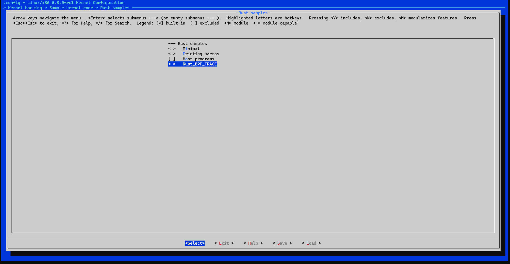
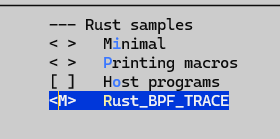

# 编译module
我们首先需要使能rust支持：
##  make menuconfig 弹出配置界面
## 关掉MODEVERSIONS
Enable Loadble module support -> Module versioning support
## 使能rust support 
General setup --> Rust support
## 使能rust sample code 
kernel hacking --> Sample Kernel code --> rust Samples 
## 选中rust BPF tarce 模块

选中后