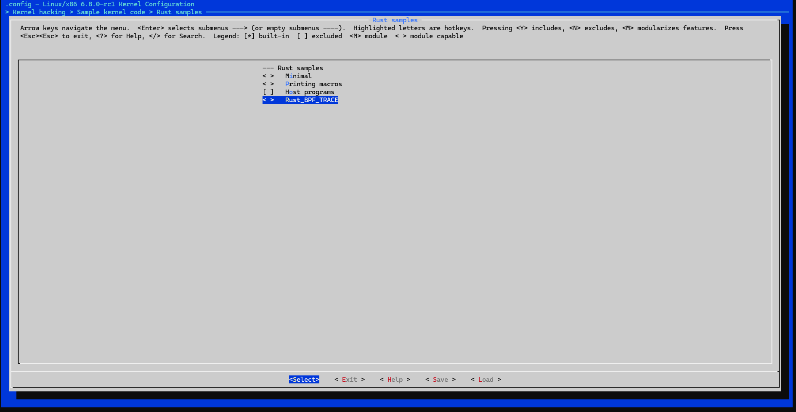

# 准备编译环境

1. rustc

需要一个特定版本的Rust编译器。较新的版本可能会也可能不会工作，因为就目前而言，内核依赖 于一些不稳定的Rust特性。

非特定版本的rustc


特定版本的rustc


2. Rust标准库源代码

Rust标准库的源代码是必需的，因为构建系统会交叉编译 core 和 alloc 。

3. libclang

libclang 是 Clang 的一个库，用于解析 C 代码。它是 bindgen 的一个依赖项。

4. bindgen

内核的C端绑定是在构建时使用 bindgen 工具生成的。这需要特定的版本。


# 修改编译选项

我们首先需要使能rust支持，然后将我们的rust模块添加到内核

在内核源码目录下执行

1. make menuconfig 弹出配置界面
关掉MODEVERSIONS
2. Enable Loadble module support -> Module versioning support
使能rust support 
3. General setup --> Rust support
使能rust 
4. kernel hacking --> Sample Kernel code --> rust Samples 
最后选中rust BPF tarce 模块




## 修改配置文件 makefile 以及Kconfig


# 编译kernel

调整好编译选项后，执行
```shell
make llvm=1 -j8
```

# 使用busybox制作初始内存盘
必要性：内核启动后，需要一个最小的文件系统，才能运行程序
作用：提供基本软件环境 提供文件系统 提供交互的shell界面
简介：······
目标：制作一个最小的initramfs，包含busybox，可交互，支持lsmod命令
1. 下载busybox
2. 编译busybox
3. 制作initramfs
4. 使用qemu启动内核

要使用BusyBox制作虚拟的初始内存盘（initramfs），你需要按照以下步骤操作。这个过程涉及到编译BusyBox、创建必要的目录结构、添加必要的配置文件，以及打包这一切成为`initramfs.cpio.gz`文件。

### 步骤 1: 编译BusyBox

1. 进入BusyBox源代码目录。
   ```bash
   cd busybox-1.33.1/
   ```

2. 配置BusyBox。
   ```bash
   make defconfig
   make menuconfig
   ```
   

3. 编译BusyBox。
   ```bash
   make
   ```

4. 安装BusyBox到一个新目录（例如`_install`）。
   ```bash
   make CONFIG_PREFIX=../busybox-install install
   ```

### 步骤 2: 创建initramfs目录结构

1. 创建你的initramfs工作目录结构。
   ```bash
   cd ..
   mkdir -p initramfs/{bin,sbin,etc,proc,sys,usr/bin,usr/sbin,root}
   ```

2. 复制BusyBox安装目录中的文件到initramfs目录。
   ```bash
   cp -a busybox-install/* initramfs/
   ```

### 步骤 3: 添加必要的配置文件和脚本

1. 创建`init`脚本。这是系统启动时第一个运行的脚本。
   ```bash
   cat > initramfs/init <<EOF
   #!/bin/sh
   mount -t proc none /proc
   mount -t sysfs none /sys
   echo "Welcome to my initramfs!"
   exec /bin/sh
   EOF
   ```

2. 使`init`脚本可执行。
   ```bash
   chmod +x initramfs/init
   ```

### 步骤 4: 打包initramfs

1. 切换到initramfs目录。
   ```bash
   cd initramfs
   ```

2. 使用`find`和`cpio`命令打包目录，并使用gzip压缩。
   ```bash
   find . | cpio -H newc -ov | gzip > ../initramfs.cpio.gz
   ```

现在，工作目录中有一个名为`initramfs.cpio.gz`的文件，这就是你的虚拟初始内存盘文件。你可以将这个文件用于Linux内核启动时的initramfs。


# 使用qemu启动内核

```shell
qemu-system-x86_64 \                      
-kernel linux-6.8.1/arch/x86_64/boot/bzImage \
-initrd initramfs.cpio.gz \   # 使用刚刚制作好的初始化内存盘
 -nographic \
-append console=ttyS0

```
选项解释：
1. -kernel 指定内核文件
2. -initrd 指定initramfs文件
3. -nographic 不使用图形界面
4. -append 指定内核启动参数 

5. console=ttyS0 告诉内核输出信息到第一个串行端口，这与 -nographic 选项配合，允许你通过终端查看虚拟机的启动日志和交互。

执行结果：


# bpftrace

# 测试
0. 使用 bpftrace 工具列出所有可用的跟踪点（tracepoints）、kprobes、uprobes 等
```shell
bpftrace -l '*'
```


1. `bpftrace -e 'tracepoint:syscalls:sys_enter_open { printf("%s %s\n", comm, str(args->filename)); }'`: 跟踪并打印每次进程尝试打开文件时的进程名称和文件名称。


2. `bpftrace -e 'tracepoint:raw_syscalls:sys_enter { @[comm] = count(); }'`: 统计并显示每个进程进行系统调用的总次数。


3. `bpftrace -e 'tracepoint:syscalls:sys_exit_read /args->ret/ { @[comm] = sum(args->ret); }'`: 统计每个进程通过 `read` 系统调用成功读取的总字节数。


4. `bpftrace -e 'tracepoint:syscalls:sys_exit_read { @[comm] = hist(args->ret); }'`: 为每个进程的 `read` 系统调用返回值生成直方图，展示读取字节大小的分布。


5. `bpftrace -e 'tracepoint:raw_syscalls:sys_enter { @ = count(); } interval:s:1 { print(@); clear(@); }'`: 每秒显示系统调用的总次数，并在显示后清除计数。


6. `bpftrace -e 'tracepoint:block:block_rq_issue { printf("%d %s %d\n", pid, comm, args->bytes); }'`: 跟踪磁盘请求事件，打印发起请求的进程ID、进程名称和请求的字节数。


7. `bpftrace -e 'software:faults:1 { @[comm] = count(); }'`: 计数每个进程引发的软件页面错误次数。


8. `bpftrace -e 'hardware:cache-misses:1000000 { @[comm, pid] = count(); }'`: 使用硬件性能监视计数器（PMCs）统计每个进程的最后一级缓存（LLC）未命中次数。


9. `bpftrace -e 'profile:hz:99 /pid == 189/ { @[ustack] = count(); }'`: 对特定进程（PID 189）以每秒99次的频率采样用户级堆栈，并进行计数。


10. `bpftrace -e 'tracepoint:syscalls:sys_enter_openat /cgroup == cgroupid("/sys/fs/cgroup/unified/mycg")/ { printf("%s\n", str(args->filename)); }'`: 跟踪并打印属于特定 cgroup-v2（`/sys/fs/cgroup/unified/mycg`）的进程尝试打开的文件名称。

