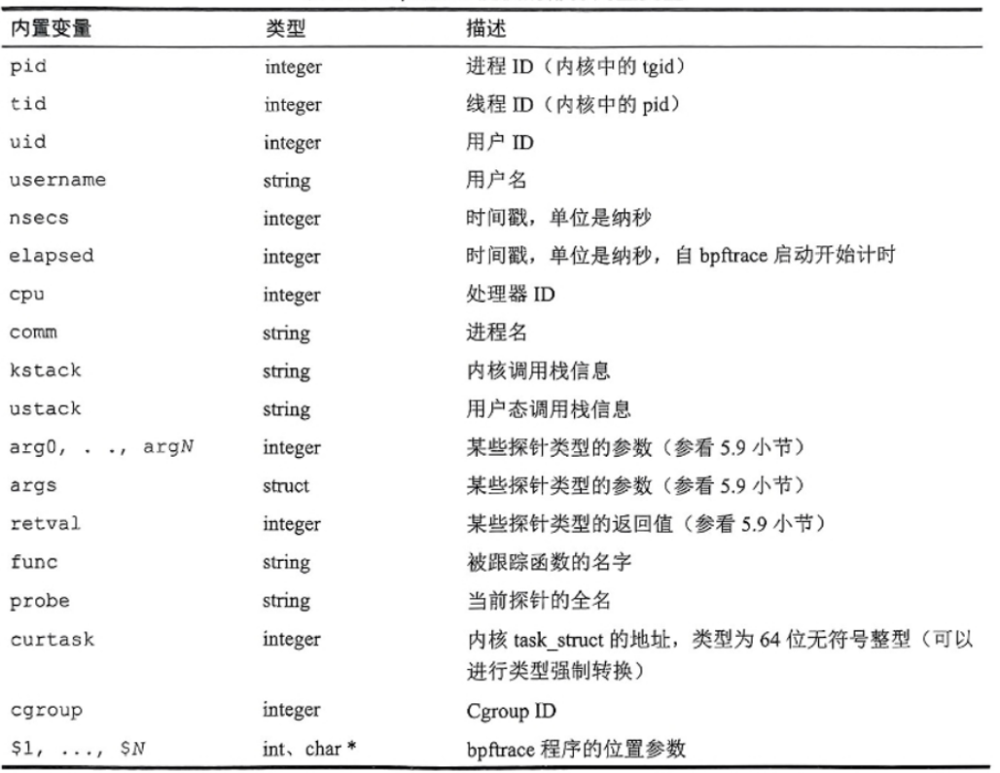
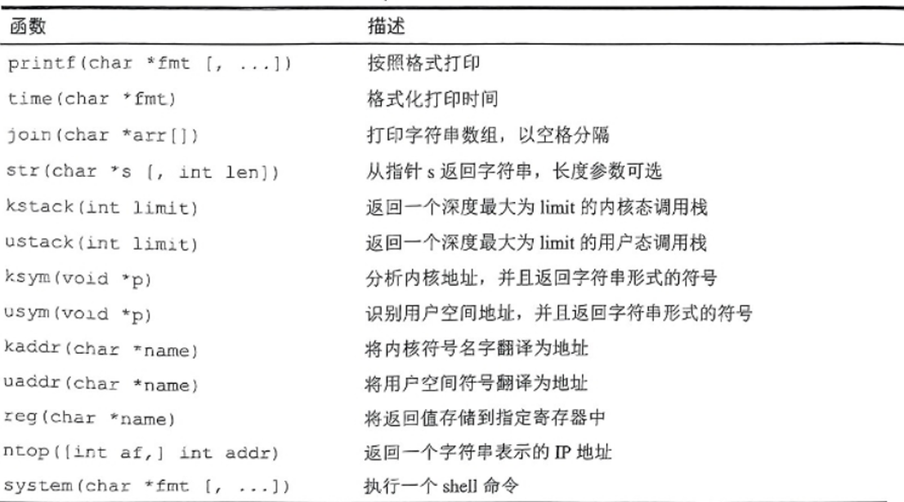
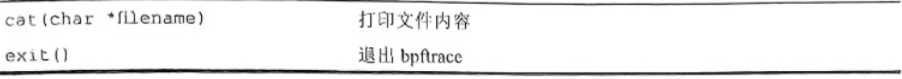
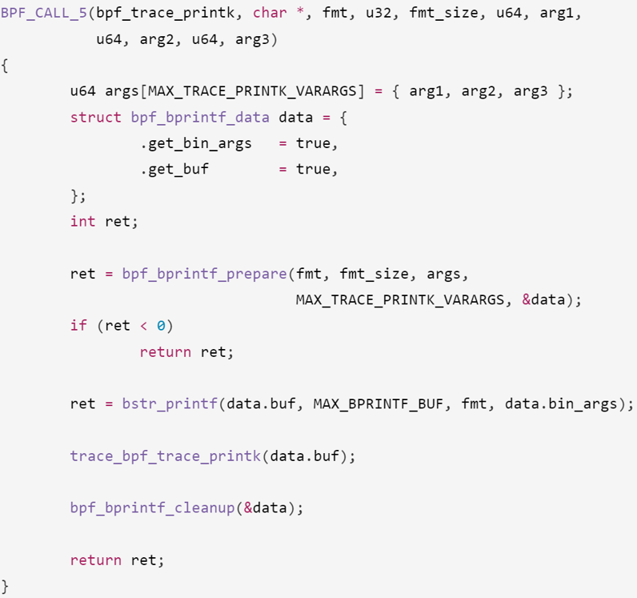
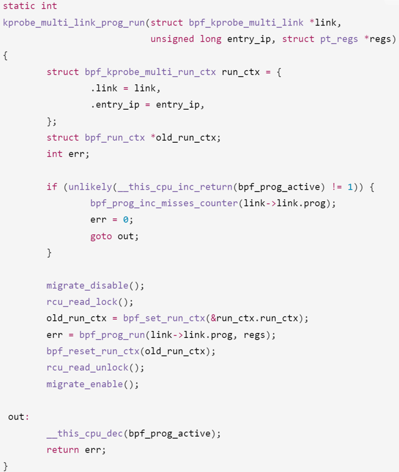
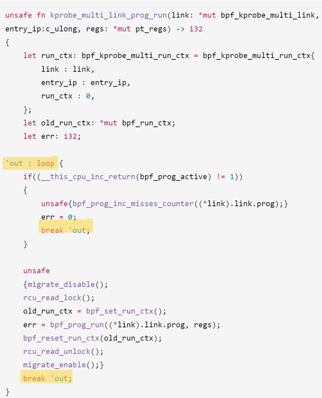
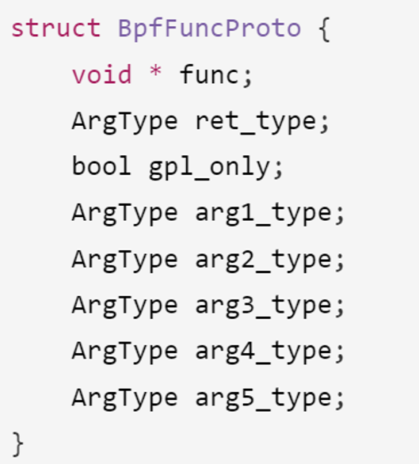
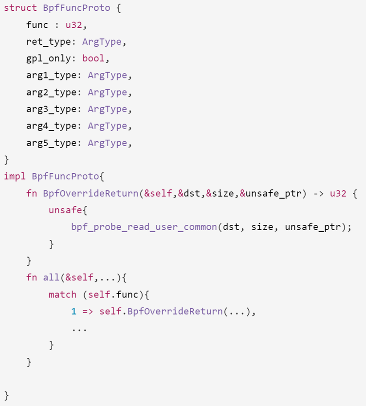

## 技术路线介绍

### 项目工具介绍
#### rustc
rustc 是 Rust 编程语言的编译器。它负责将 Rust 代码编译成可执行文件或其他类型的二进制文件。在编译过程中，rustc 会检查代码中的错误和潜在问题，并提供错误信息和警告。rustc 还支持交叉编译，从而可以在一个平台上编译代码，生成另一个平台上运行的可执行文件。同时 rustc 提供了多种编译选项，并且Rust 允许在代码中使用属性来控制 rustc 的行为，可以根据需要优化生成的代码。
#### Rust 标准库（std）
Rust 标准库（std）是 Rust 编程语言的核心部分，提供了一系列预定义的功能，如数据类型、I/O 操作、并发编程工具等，这些功能对于日常的 Rust 开发来说是不可或缺的。这个标准库具有以下特点：[1]

1. 丰富的数据类型：标准库提供了多种基本数据类型和复合数据类型，如 Vec<T>、HashMap<K, V> 等，这些类型是高效、安全编程的基础。

2. 错误处理：Rust 标准库中包含了错误处理机制，如 Result<T, E> 和 Option<T> 枚举，它们是 Rust 错误处理和可选值处理的核心。

3. 并发编程：标准库提供了多种并发编程工具，包括线程、通道（channels）、互斥锁（Mutex）等，这些工具帮助开发者构建高效且安全的并发应用。

4. I/O 和网络：标准库中的 std::io 模块提供了一系列进行输入和输出操作的功能，std::net 模块则提供了网络编程的相关功能。

5. 平台抽象和兼容性：Rust 标准库对不同操作系统平台的底层细节进行了抽象，使得 Rust 代码可以在多种平台上编译和运行，同时保持高度的兼容性和性能。
#### libclang
libclang 是 LLVM 项目的一部分，提供了对 Clang 编译器前端的 C 接口。以下是其特点：

1. 源代码解析：libclang 提供了解析 C、C++、Objective-C 和 Objective-C++ 源代码的能力，使得开发者可以构建自定义的静态分析工具、代码编辑器插件或者代码浏览器。

2. 抽象语法树（AST）：通过 libclang，开发者可以访问源代码的抽象语法树（AST）。AST 是源代码的树状表示，展示了代码的结构和语法元素之间的关系，这对于进行复杂的代码分析和转换非常有用。

3. 跨平台：libclang 支持多个平台，包括 Windows、Linux 和 macOS。这意味着使用 libclang 开发的工具可以在多个操作系统上运行。

4. 工具支持：libclang 是许多流行开发工具背后的驱动力，例如代码编辑器中的语法高亮、代码补全、代码导航等功能。例如，一些基于 libclang 的工具可以提供准确的代码补全建议，甚至在代码尚未编译的情况下也能做到。

5. 易于使用的 API：尽管 libclang 是用 C 语言编写的，它提供了一套易于使用的 API，使得开发者可以方便地集成和使用 Clang 的强大功能。
#### bindgen
bindgen 是一个 Rust 工具，用于自动生成 Rust 绑定到 C 和 C++ 代码的库。它利用 libclang 来解析头文件，从而生成 Rust 代码，使得 Rust 程序能够安全地调用 C 或 C++ 代码。以下是其主要特点：

1. 自动化生成绑定：bindgen 自动化地从 C 或 C++ 的头文件生成 Rust 绑定，极大地简化了在 Rust 代码中使用 C/C++ 库的过程。

2. 类型安全：生成的绑定尽可能地保持类型安全，使得在 Rust 中调用 C/C++ 代码时能够享受到 Rust 的类型安全保证。

3. 自定义化：虽然 bindgen 的默认行为适用于许多场景，但它也提供了丰富的命令行选项和属性，允许开发者根据需要自定义生成的绑定。

4. 跨平台：bindgen 支持生成可以在多个平台上使用的绑定，包括但不限于 Windows、Linux 和 macOS。

5. 集成 libclang：bindgen 使用 libclang 来解析 C/C++ 的头文件，这意味着它可以处理复杂的语言特性和宏。
### 改写依据和基本方法
改写依据是bpf_trace.c以及其依赖的头文件。基本方法是先整体阅读一遍代码，大致了解代码的功能和结构，发现代码结构基本呈现**函数定义+结构体**这一种模式，然后逐个**函数+结构体块**进行改写。
### 原C代码整体简介
bpf_trace.c定义了大量的bpf_trace的编程函数，这些函数用于帮助用户编写BPF程序，并且能够极大简化这一过程。这些函数包括对BPF程序的加载、卸载、运行、调试等操作。bpf_trace.c还定义了一些结构体，用于存储BPF程序的信息。[2]

以下是内置变量表：





**具体函数解析**：



- 输入：

char *fmt：格式化字符串，指定如何格式化输出

u32 fmt_size：格式化字符串的大小

u64 arg1，u64 arg2，u64 arg3

- 输出：

int：格式化字符串的长度或错误码

- 功能：

格式化输出调试信息，并将其写入到调试日志中

### 改写思路和改写规则制定
#### 从C语言常量宏到Rust语言全局常量
在C语言中，常量宏是通过预处理器指令#define来定义的。它们在编译前被替换到代码中每一个使用它们的地方。

**优点**：
- 简单易用，可以在不改变代码逻辑的情况下快速修改值。

**缺点**:
- 类型不安全，因为预处理器只是简单地文本替换，不进行类型检查。

Rust通过const关键字或静态生命周期的static关键字来定义全局常量。

**优点**：
- 类型安全，Rust的编译器会检查常量的类型。
- 可以定义复杂类型的常量，而不仅仅是基本类型。
- const定义的常量在编译时就被评估，不占用运行时内存；static定义的常量在程序的整个运行期间都存在。

**缺点**:
- 相比C语言宏，学习曲线稍微陡峭，需要理解Rust的内存管理和所有权模型。

**改写示例**：

C语言中的常量宏：
```c
#define EOVERFLOW 1
```
改写为：
```rust
static EOVERFLOW: i32 = 1;
```
#### Rust调用C语言函数
通过 extern "C" 声明后结合 unsafe 关键字，可以在Rust中调用C语言函数。

**改写示例**：

C语言代码：
```c
if(sleepable)
    rcu_read_lock_trace();
else 
    rcu_read_lock();
```
改写为：
```rust
extern "C" {
    fn rcu_read_lock_trace();
    fn rcu_read_lock();
}
unsafe {
    if sleepable {
        rcu_read_lock_trace();
    } else {
        rcu_read_lock();
    }
}
```
#### C语言的条件编译到Rust的cfg
C语言中的条件编译是通过预处理器指令 #ifdef 和 #endif 来实现的。在Rust中，可以使用 cfg 属性来实现条件编译。

**cfg的优势**：

Rust的cfg属性是语言的一部分，编译器会检查条件编译的代码，确保即使代码未被编译执行，也符合Rust的类型安全要求。而C语言的预处理器仅进行文本替换，不会进行类型检查。

**改写示例**：

C语言代码：
```c
#ifdef CONFIG_BPF_KPROBE_OVERRIDE
    // some code
#endif
```
改写为：
```rust
#[cfg(CONFIG_BPF_KPROBE_OVERRIDE)]
{
    // some code
}
```
#### 从C语言的goto到Rust的loop和break
C语言中的goto语句是一种无条件跳转语句，可以直接跳转到代码中的任意位置。Rust中没有goto语句，但可以通过loop和break语句来实现同样的功能。

**改写示例**：

C语言代码：



Rust语言代码：



#### 从C语言的结构体到Rust的结构体
这里的改写不仅将C语言的结构体改写为Rust的结构体，还会将其中包含的函数体指针一并用impl块实现。

**改写示例**：

C语言代码：



Rust语言代码：




## Rust改写结果分析

### Rust改写代码整体简介
由于bpf_trace.c中的结构较为清晰，因此在改写过程中，我们将每个函数+结构体块分别进行改写，将C语言的常量宏改写为Rust的全局常量，将C语言的条件编译改写为Rust的cfg属性，将C语言的goto语句改写为Rust的loop和break语句，将C语言的结构体改写为Rust的结构体。

### 部分模块改写展示及功能分析

```rust
fn bpf_trace_vprintk(fmt: &str, fmt_size: u32, args: *const u64, data_len: u32) -> i32 {
    let mut data = BpfBprintfData {
        get_bin_args: true,
        get_buf: true,
        buf: Vec::new(),
        bin_args: Vec::new(),
    };

    if data_len as usize % 8 != 0 || data_len as usize > MAX_BPRINTF_VARARGS * 8 || (data_len > 0 && args.is_null()) {
        return EINVAL;
    }
    let num_args = (data_len / 8) as usize;

    let ret = unsafe{bpf_bprintf_prepare(fmt, fmt_size, args, num_args, &mut data)};
    if ret < 0 {
        return ret;
    }

    let ret = unsafe{bstr_printf(&mut data.buf, MAX_BPRINTF_BUF, fmt, &data.bin_args)};
    unsafe{trace_bpf_trace_printk(&data.buf)};

    ret
}
```

这个函数bpf_trace_vprintk在bpf-trace中的功能是格式化并打印跟踪信息。它通过以下步骤实现：

1. 初始化数据结构：首先，它创建一个BpfBprintfData结构体实例，用于存储格式化打印所需的信息，包括二进制参数和缓冲区。

2. 参数校验：接着，函数检查传入的参数长度是否符合要求（即长度是8的倍数，不超过最大允许的参数个数，且如果长度大于0，参数指针不为null）。如果不符合，函数返回EINVAL（一个错误码，表示无效的参数）。

3. 准备格式化打印：通过调用bpf_bprintf_prepare函数，准备格式化打印的数据。这个步骤涉及解析格式字符串和参数，准备好要打印的数据。

4. 执行格式化打印：然后，使用bstr_printf函数将格式化的数据写入缓冲区。

5. 打印信息：最后，通过trace_bpf_trace_printk函数将缓冲区中的数据打印到跟踪日志中。

## 参考文献
[1] Klabnik, S., & Nichols, C. (2019). *The Rust Programming Language*. No Starch Press.

[2] Gregg, B. (2019). *BPF Performance Tools: Linux System and Application Observability*. Addison-Wesley Professional.
## 相关链接

[Rust Bindgen Guide](https://rust-lang.github.io/rust-bindgen/)

[libclang](https://clang.llvm.org/doxygen/group__CINDEX.html)