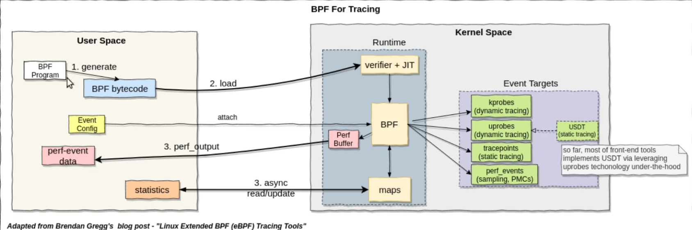

- 为什么bpf是Linux性能优化的法宝？

# 6.28改写426-452行
## 原代码分析
这段代码是在实现`bpf_trace_vprintk`函数的具体逻辑。从代码的结构和命名可以看出以下几点：

1. **函数签名**：`BPF_CALL_4`宏的使用表明这是一个BPF调用，接受4个参数。这是Linux内核中用于定义BPF辅助函数的常用宏。`bpf_trace_vprintk`是函数的名称，后面跟着的是参数列表，包括格式字符串`fmt`、格式字符串的大小`fmt_size`、指向参数的指针`args`以及参数数据的长度`data_len`。

2. **参数检查**：函数开始部分首先进行参数有效性检查。这包括检查`data_len`是否是8的倍数（因为参数是以64位（即8字节）为单位传递的）、`data_len`是否超过了最大允许的参数大小（`MAX_BPRINTF_VARARGS * 8`），以及如果`data_len`非零时`args`指针是否为`NULL`。这些检查确保了传入的参数是有效和安全的。

3. **数据准备**：通过调用`bpf_bprintf_prepare`函数，准备打印数据。这个函数可能会处理参数，准备缓冲区等，以便后续的格式化输出。

4. **格式化输出**：使用`bstr_printf`函数将格式化的字符串输出到`data.buf`缓冲区中。这个步骤实际上是将传入的格式字符串和参数按照指定的格式组合成最终的输出字符串。

5. **打印输出**：通过调用`trace_bpf_trace_printk`函数，将格式化后的字符串输出到跟踪系统。这允许开发者在内核跟踪日志中看到BPF程序的输出信息。

6. **清理资源**：最后，通过调用`bpf_bprintf_cleanup`函数清理分配的资源。这是良好的编程实践，确保不会有内存泄漏。

整体来看，这段代码通过一系列的步骤实现了`bpf_trace_vprintk`函数，使得BPF程序能够输出格式化的跟踪信息。这对于调试和监控BPF程序的行为非常有用。

## 改写分析
这段C代码是Linux内核中BPF（Berkeley Packet Filter）的一部分，用于实现一个名为bpf_trace_vprintk的函数，该函数允许BPF程序打印格式化的跟踪信息。它接受一个格式字符串fmt、格式字符串的大小fmt_size、一个指向参数的指针args以及参数数据的长度data_len。函数首先检查参数的有效性，然后准备打印数据，最后使用bstr_printf函数将格式化的字符串输出到跟踪缓冲区，并通过trace_bpf_trace_printk函数将其打印出来。

下面是如何用Rust重写这段代码的步骤，

定义一个结构体BpfBprintfData来存储打印数据。
实现bpf_trace_vprintk函数，包括参数有效性检查、准备打印数据、格式化字符串输出以及清理资源。
使用Rust的标准库和一些假设的外部函数（因为Rust标准库中没有直接与内核跟踪相关的函数）。
