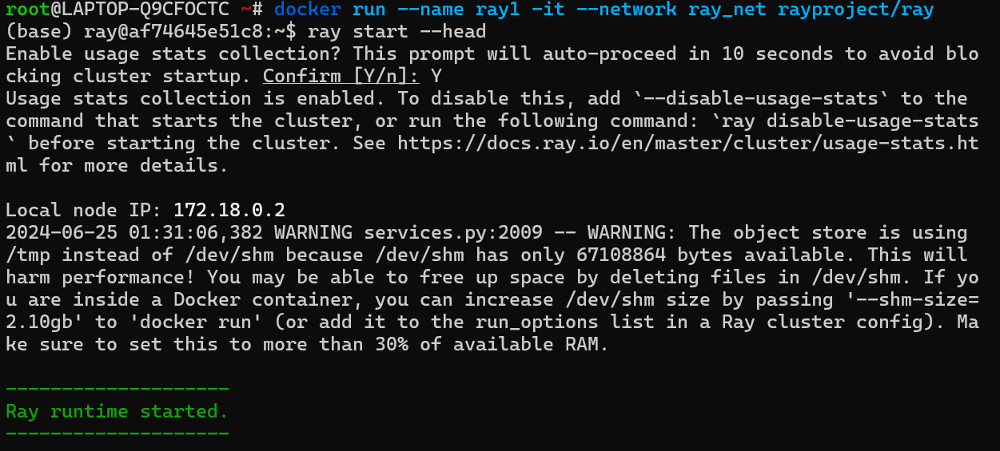
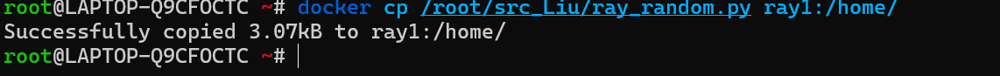
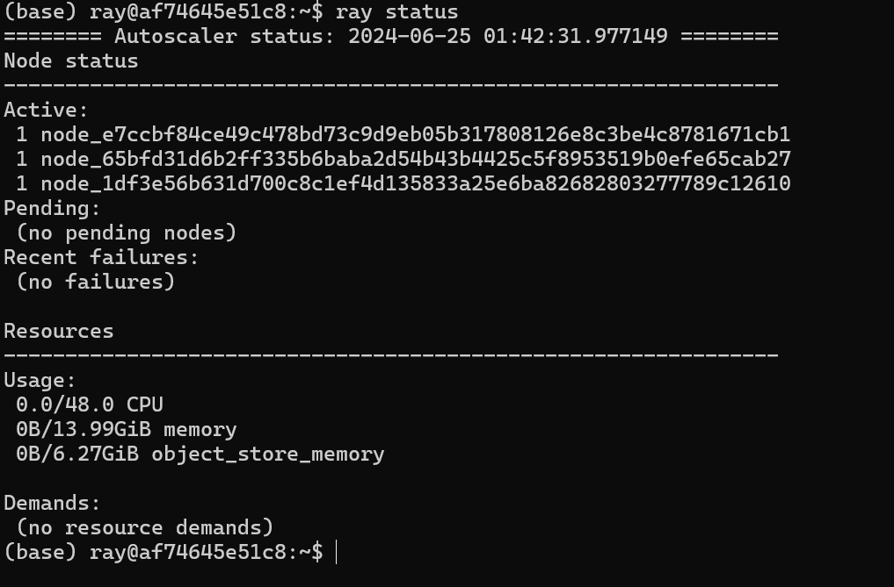
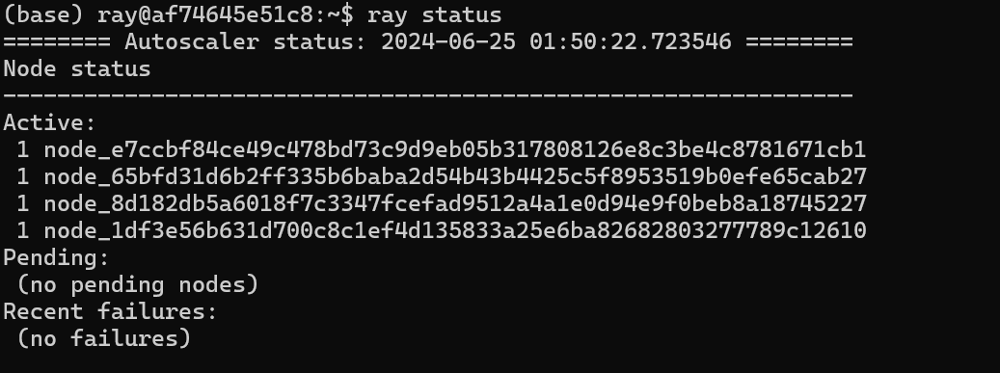

# 单机部署
- 前提：已经安装好了python3和pip
- 安装ray
```shell
pip install -U "ray[default]"
```
- 启动ray

可以在python交互界面中启动ray
```python
import ray
ray.init()
···
ray.shutdown()
```
也可以在命令行中启动ray cluster head
```shell
ray start --head --port=6379
```
- 查看dashboard

完成启动后，可以打开网页：http://127.0.0.1:8265


# 基于docker的部署
可以采用ray提供的docker镜像进行部署，也可以自己构建镜像。这里介绍使用rayproject/ray镜像进行部署。

## docker安装完成后换源

- 在配置文件 /etc/docker/daemon.json 中加入：

```json
{
  "registry-mirrors": ["https://docker.mirrors.ustc.edu.cn/"]
}
```
- 重启docker
```shell
sudo systemctl restart docker
```

## 下载rayproject/ray镜像
```shell
docker pull rayproject/ray:latest
```

## 启动一个容器作为head节点


## 将代码拷贝到容器中



## 启动多个容器作为worker节点


增加节点

